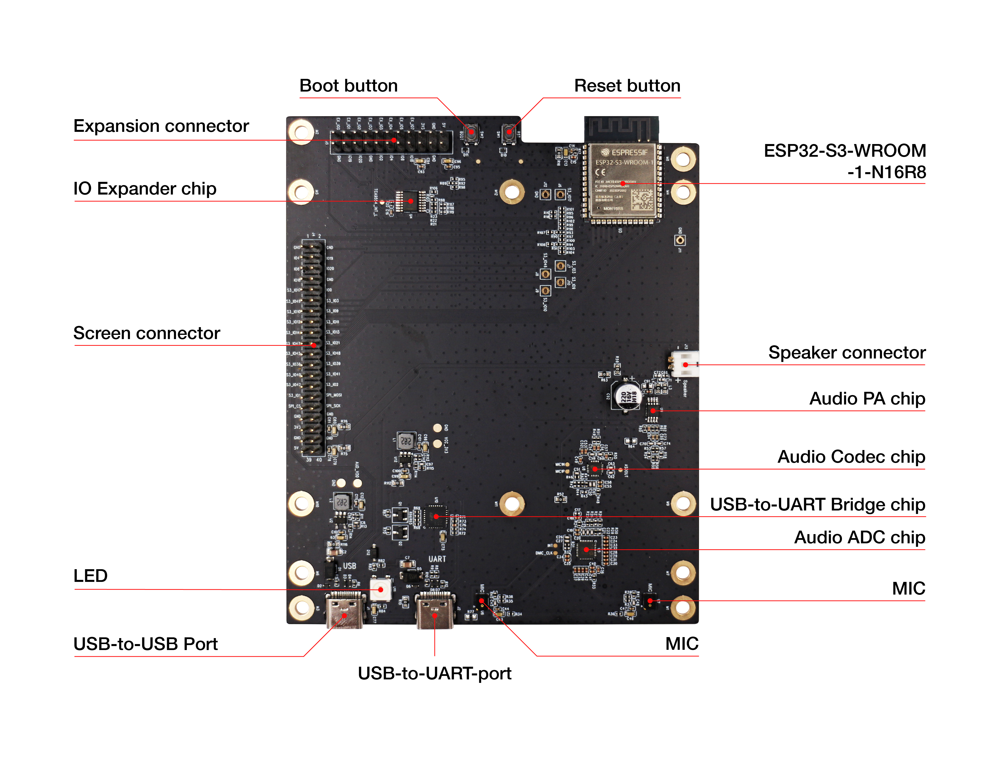
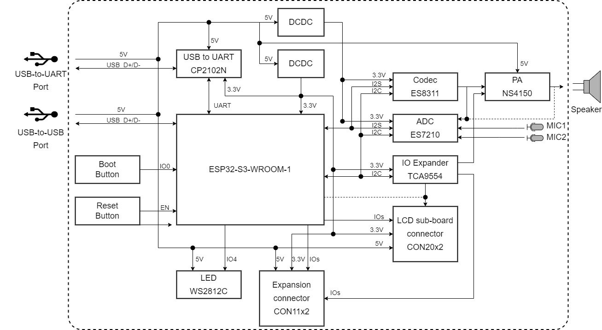
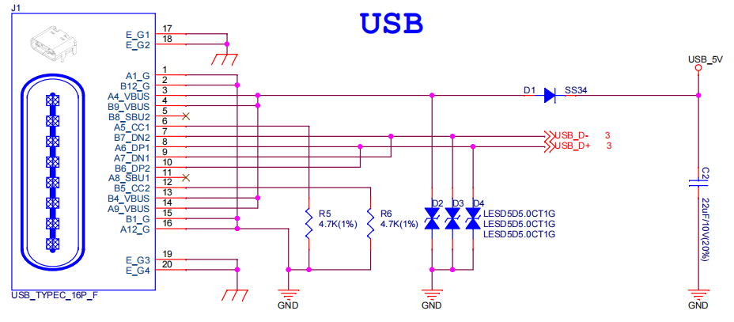
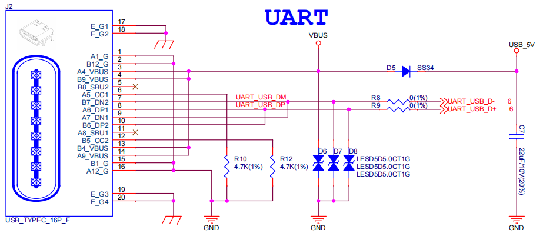
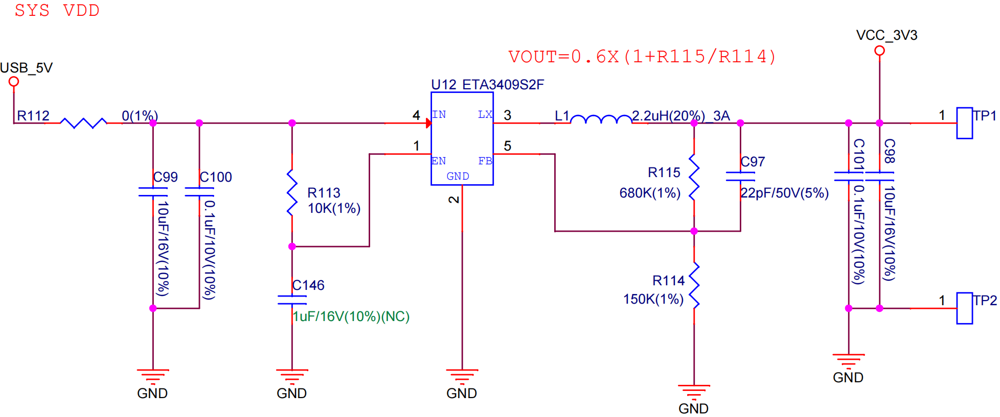
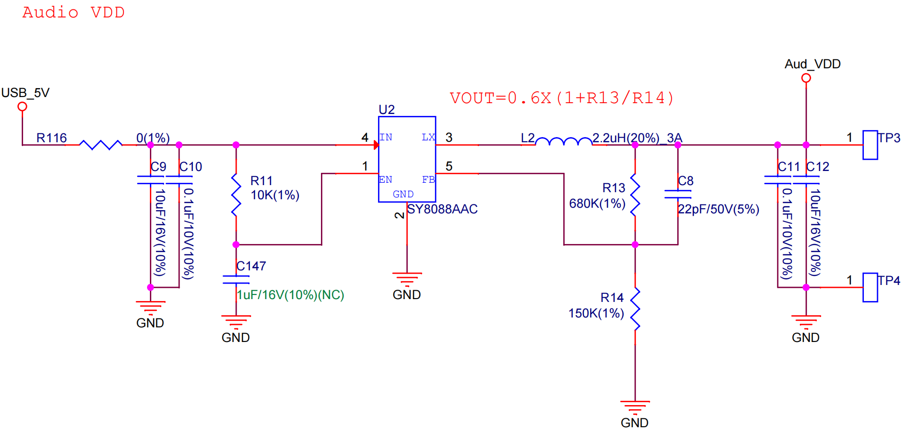
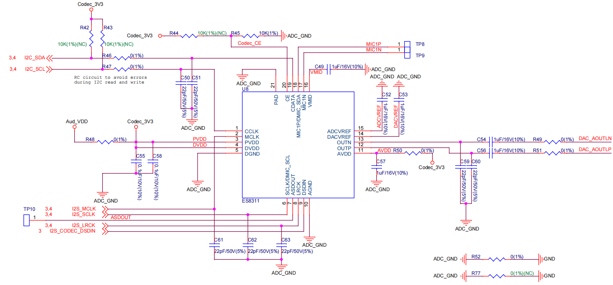
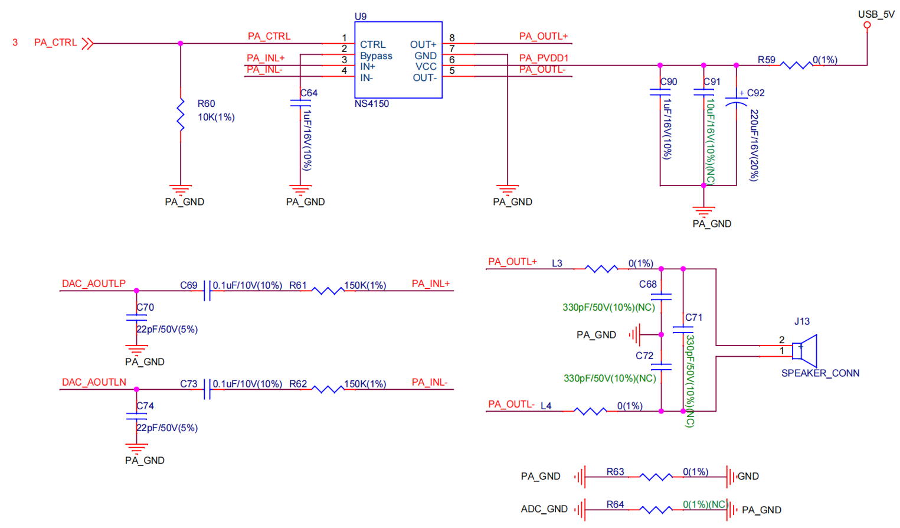
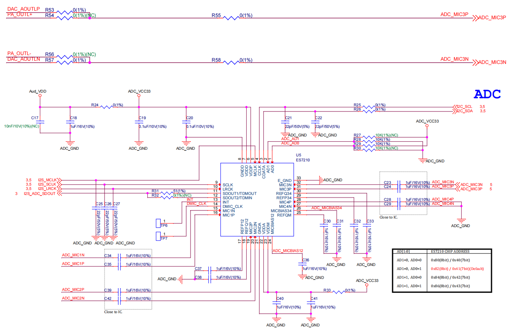

=====================
ESP32-S3-LCD-Ev-Board
=====================

:link_to_translation:`en: [English]`

本指南将帮助您快速上手 ESP32-S3-LCD-Ev-Board，并提供该款开发板的详细信息。

ESP32-S3-LCD-Ev-Board 是一款基于 ESP32-S3 芯片的屏幕交互开发板，通过配合不同类型的 LCD 子板，可以驱动 IIC、SPI、8080 以及 RGB 接口的 LCD 显示屏。同时它还搭载双麦克风阵列，支持语音识别和近/远场语音唤醒，具有触摸屏交互和语音交互功能，满足用户对多种不同分辨率以及接口的触摸屏应用产品的开发需求。该开发板具有以下特性：

-  板载 ESP32-S3-WROOM-1 模组，内置 16 MB Flash + 8MB PSRAM
-  可搭配不同屏幕子板使用，支持 ``RGB``, ``8080``, ``SPI`` 以及 ``I2C`` 接口屏幕
-  板载音频 Codec + ADC 音频功放，支持双麦克风拾音
-  板载 USB 转串口芯片，并且支持 USB Type-C 接口下载调试

.. figure:: ../_static/esp32-s3-lcd-ev-board-isometric-raw.png
    :align: center
    :scale: 20%
    :alt: ESP32-S3-LCD-Ev-Board（点击图片放大）

    ESP32-S3-LCD-Ev-Board（点击图片放大）

本指南包括如下内容：

- `入门指南`_：简要介绍了开发板和硬件、软件设置指南。
- `硬件参考`_：详细介绍了开发板的硬件。
- `相关文档`_：列出了相关文档的链接。

入门指南
========

本节介绍如何开始使用 ESP32-S3-LCD-Ev-Board。首先，在 **组件介绍** 小节介绍一些关于开发板的基本信息，然后在 **应用程序开发** 小节介绍如何开始使用该开发板进行应用开发，最后介绍该开发板包装和零售信息。

组件介绍
--------

ESP32-S3-LCD-Ev-Board 开发板主要由以下两个部分组成：

主板
^^^^

**ESP32-S3-LCD-Ev-Board_MB** 主板是整个套件的核心，该主板集成了 ESP32-S3-WROOM-1 模组，并提供与 LCD 子板连接的端口。

    ESP32-S3-LCD-Ev-Board_MB（点击放大）

以下按照逆时针的顺序依次介绍开发板上的主要组件。

.. list-table::
   :widths: 30 70
   :header-rows: 1

   * - 主要组件
     - 介绍
   * - ESP32-S3-WROOM-1-N16R8 模组
     - ESP32-S3-WROOM-1-N16R8 模组是一款通用型 Wi-Fi + 低功耗蓝牙 MCU 模组，搭载 ESP32-S3 系列芯片，内置 16 MB Flash + 8MB PSRAM。除具有丰富的外设接口外，模组还拥有强大的神经网络运算能力和信号处理能力，适用于 AIoT 领域的多种应用场景。
   * - Reset 按键 (Reset button)
     - Reset：单独按下此按键会重置系统。
   * - Boot 按键 (Boot button)
     - Boot：长按 Boot 键时，再按 Reset 键可启动固件上传模式，然后便可通过串口或 USB 上传固件。
   * - 扩展连接器 (Expansion connect)
     - 可供连接所有的 IO 扩展芯片引脚、系统电源引脚以及部分模组引脚。
   * - IO 扩展芯片 (IO Expander chip)
     - `TCA9554 <https://www.ti.com/lit/gpn/tca9554>`_ 是一款 8 位通用并行输入和输出 IO 扩展芯片，它通过两线 I2C 通信控制 IO 口的模式以及输出电平，丰富了系统的 IO 应用场景。
   * - LCD 子板连接器 (Screen connector)
     - 通过 2.54 mm 间距的连接器可以连接三种不同类型的 LCD 子板。
   * - LED
     - 具有 RGB 三色显示功能，可供用户配置用来做状态行为指示。
   * - USB-to-USB 端口 (USB-to-USB Port)
     - | 为整个系统提供电源（两者选一）。建议使用至少 5V/2A 电源适配器供电，保证供电稳定。
       | 用于 PC 端与 ESP32-S3-WROOM-1 模组的 USB 通信。
   * - USB-to-UART 端口 (USB-to-UART Port)
     - | 为整个系统提供电源（两者选一）。建议使用至少 5V/2A 电源适配器供电，保证供电稳定。
       | 用于 PC 端与 ESP32-S3-WROOM-1 模组的串口通信。
   * - 左侧麦克风 (MIC)
     - 板载麦克风，连接至 ADC。
   * - 右侧麦克风 (MIC)
     - 板载麦克风，连接至 ADC。
   * - 音频模数转换器 (Audio ADC chip)
     - `ES7210 <http://www.everest-semi.com/pdf/ES7210%20PB.pdf>`_ 是一款用于麦克风阵列应用的高性能、低功耗 4 通道音频模数转换器，非常适合音乐和语音应用。此外，ES7210 也可以用作声学回声消除 (AEC)。
   * - USB-to-UART 桥接器 (USB-to-UART Bridge chip)
     - 单芯片 USB-UART 桥接器 CP2102N 为软件下载和调试提供高达 3 Mbps 的传输速率。
   * - 音频编解码芯片 (Audio Codec chip)
     - `ES8311 <http://www.everest-semi.com/pdf/ES8311%20PB.pdf>`_ 是一种低功耗单声道音频编解码器，包含单通道 ADC、单通道 DAC、低噪声前置放大器、耳机驱动器、数字音效、模拟混音和增益功能。它通过 I2S 和 I2C 总线与 ESP32-S3-WROOM-1 模组连接，以提供独立于音频应用程序的硬件音频处理。
   * - 音频功率放大器 (Audio PA chip)
     - NS4150 是一款低 EMI、3 W 单声道 D 类音频功率放大器，用于放大来自音频编解码芯片的音频信号，以驱动扬声器。
   * - 扬声器连接器 (Speaker connector)
     - 可通过音频功率放大器的支持，实现外部扬声器播放功能。

LCD 子板
^^^^^^^^

- **ESP32-S3-LCD-Ev-Board_SUB2** 子板提供了两种屏幕接口，分别支持连接一块 RGB 接口屏或者一块 8080 并口屏。当前子板贴装了一块 3.95 英寸、RGB565 接口、分辨率为 480x480 的触摸屏，该屏使用的 LCD 驱动芯片型号为 GC9503CV，触摸驱动芯片型号为 FT5x06。

.. figure:: ../_static/esp32-s3-lcd-ev-board-sub2-front.png
    :align: center
    :scale: 20%
    :alt: ESP32-S3-LCD-Ev-Board_SUB2 正面（点击图片放大）

    ESP32-S3-LCD-Ev-Board_SUB2 正面（点击图片放大）

.. figure:: ../_static/esp32-s3-lcd-ev-board-sub2-back.png
    :align: center
    :scale: 20%
    :alt: ESP32-S3-LCD-Ev-Board_SUB2 反面（点击图片放大）

    ESP32-S3-LCD-Ev-Board_SUB2 反面（点击图片放大）

- **ESP32-S3-LCD-Ev-Board_SUB3** 子板仅支持 4.3 英寸、RGB565 接口、分辨率为 800x480 的触摸屏，该屏使用触摸驱动芯片型号为 GT1151。

.. figure:: ../_static/esp32-s3-lcd-ev-board-sub3-front.png
    :align: center
    :scale: 20%
    :alt: ESP32-S3-LCD-Ev-Board_SUB3 正面（点击图片放大）

    ESP32-S3-LCD-Ev-Board_SUB3 正面（点击图片放大）

.. figure:: ../_static/esp32-s3-lcd-ev-board-sub3-back.png
    :align: center
    :scale: 20%
    :alt: ESP32-S3-LCD-Ev-Board_SUB3 反面（点击图片放大）

    ESP32-S3-LCD-Ev-Board_SUB3 反面（点击图片放大）

应用程序开发
-------------

通电前，请确保开发板完好无损。

必备硬件
^^^^^^^^

- 1 x ESP32-S3-LCD-Ev-Board_MB
- 1 x LCD 子板
- 2 x USB 2.0 数据线（标准 A 型转 Type-C 型）
- 1 x 电脑（Windows、Linux 或 macOS）

.. note::

  请确保使用适当的 USB 数据线。部分数据线仅可用于充电，无法用于数据传输和程序烧录。

可选硬件
^^^^^^^^

- 1 x 扬声器

硬件设置
^^^^^^^^

1. 连接 LCD 子板至 **LCD 子板连接器** 端口。
2. 插入 USB 数据线，分别连接 PC 与开发板的两个 USB 端口之一。
3. LCD 屏幕开始显示 UI 界面，可以用手指与触摸屏进行交互。

软件设置
^^^^^^^^

请前往 `快速入门 <https://docs.espressif.com/projects/esp-idf/zh_CN/latest/esp32s3/get-started/index.html>`__ 中 `详细安装步骤 <https://docs.espressif.com/projects/esp-idf/zh_CN/latest/esp32s3/get-started/index.html#get-started-step-by-step>`__ 一节查看如何快速设置开发环境。

内容和包装
-----------

可分开购买主板或主板配件，其中配件包含：

- LCD 扩展板：ESP32-S3-LCD-Ev-Board_SUB3

零售订单
^^^^^^^^

如购买样品，每个开发板将以防静电袋或零售商选择的其他方式包装。

零售订单请前往 https://www.espressif.com/zh-hans/company/contact/buy-a-sample。

批量订单
^^^^^^^^

如批量购买，开发板将以大纸板箱包装。

批量订单请前往 https://www.espressif.com/zh-hans/contact-us/sales-questions。

硬件参考
========

功能框图
--------

ESP32-S3-LCD-Ev-Board 的主要组件和连接方式如下图所示。

    ESP32-S3-LCD-Ev-Board 电气功能框图

供电说明
--------

USB 供电
^^^^^^^^

开发板有两种 USB 供电方式：

- 通过 ``USB-to-USB`` 端口供电

    ESP32-S3-LCD-Ev-Board - USB-to-USB 电源供电

- 通过 ``USB-to-UART`` 端口供电

    ESP32-S3-LCD-Ev-Board - USB-to-UART 电源供电

音频和数字独立供电
^^^^^^^^^^^^^^^^^^

ESP32-S3-LCD-Ev-Board 可为音频组件和 ESP 模组提供相互独立的电源，可降低数字组件给音频信号带来的噪声并提高组件的整体性能。

    ESP32-S3-LCD-Ev-Board - 数字供电

    ESP32-S3-LCD-Ev-Board - 音频供电

GPIO 分配列表
-------------

下表为 ESP32-S3-WROOM-1 模组管脚的 GPIO 分配列表，用于控制开发板的特定组件或功能。

.. list-table:: ESP32-S3-WROOM-1 GPIO 分配
   :header-rows: 1
   :widths: 10 10 10 10 10 10 10 10

   * - 管脚 [#one]_
     - 管脚名称
     - ES8311
     - ES7210
     - LCD
     - 按键
     - IO 扩展芯片
     - 其他
   * - 3
     - EN
     -
     -
     -
     - RESET
     -
     -
   * - 4
     - IO4
     -
     -
     -
     -
     -
     - LED
   * - 5
     - IO5
     - I2S_MCLK
     - I2S_MCLK
     -
     -
     -
     -
   * - 6
     - IO6
     - I2S_CODEC_DSDIN
     -
     -
     -
     -
     -
   * - 7
     - IO7
     - I2S_LRCK
     - I2S_LRCK
     -
     -
     -
     -
   * - 8
     - IO15
     -
     - I2S_ADC_SDOUT
     -
     -
     -
     -
   * - 9
     - IO16
     - I2S_SCLK
     - I2S_SCLK
     -
     -
     -
     -
   * - 10
     - IO17
     -
     -
     - LCD_DE
     -
     -
     -
   * - 11
     - IO18
     - I2C_SCL
     - I2C_SCL
     - TP_I2C_SCL
     -
     - I2C_SCL
     -
   * - 12
     - IO8
     - I2C_SDA
     - I2C_SDA
     - TP_I2C_SDA
     -
     - I2C_SDA
     -
   * - 13
     - IO19
     -
     -
     -
     -
     -
     - USB_D-
   * - 14
     - IO20
     -
     -
     -
     -
     -
     - USB_D+
   * - 15
     - IO3
     -
     -
     - LCD_VSYNC
     -
     -
     -
   * - 16
     - IO46
     -
     -
     - LCD_HSYNC
     -
     -
     -
   * - 17
     - IO9
     -
     -
     - LCD_PCLK
     -
     -
     -
   * - 18
     - IO10
     -
     -
     - LCD_DATA0
     -
     -
     -
   * - 19
     - IO11
     -
     -
     - LCD_DATA1
     -
     -
     -
   * - 20
     - IO12
     -
     -
     - LCD_DATA2
     -
     -
     -
   * - 21
     - IO13
     -
     -
     - LCD_DATA3
     -
     -
     -
   * - 22
     - IO14
     -
     -
     - LCD_DATA4
     -
     -
     -
   * - 23
     - IO21
     -
     -
     - LCD_DATA5
     -
     -
     -
   * - 24
     - IO47
     -
     -
     - LCD_DATA6
     -
     -
     -
   * - 25
     - IO48
     -
     -
     - LCD_DATA7
     -
     -
     -
   * - 26
     - IO45
     -
     -
     - LCD_DATA8
     -
     -
     -
   * - 27
     - IO0
     -
     -
     -
     - BOOT
     -
     -
   * - 28
     - IO35
     -
     -
     -
     -
     -
     - NC
   * - 29
     - IO36
     -
     -
     -
     -
     -
     - NC
   * - 30
     - IO37
     -
     -
     -
     -
     -
     - NC
   * - 31
     - IO38
     -
     -
     - LCD_DATA9
     -
     -
     -
   * - 32
     - IO39
     -
     -
     - LCD_DATA10
     -
     -
     -
   * - 33
     - IO40
     -
     -
     - LCD_DATA11
     -
     -
     -
   * - 34
     - IO41
     -
     -
     - LCD_DATA12
     -
     -
     -
   * - 35
     - IO42
     -
     -
     - LCD_DATA13
     -
     -
     -
   * - 36
     - RXD0
     -
     -
     -
     -
     -
     - UART_RXD0
   * - 37
     - TXD0
     -
     -
     -
     -
     -
     - UART_TXD0
   * - 38
     - IO2
     -
     -
     - LCD_DATA14
     -
     -
     -
   * - 39
     - IO1
     -
     -
     - LCD_DATA15
     -
     -
     -
   * - 41
     - EPAD
     -
     -
     -
     -
     -
     -

.. [#one] 管脚 - ESP32-S3-WROOM-1 模组管脚号，不含 GND 和供电管脚。

分配给 IO 扩展芯片的 GPIO 被近一步分配为多个 GPIO。

.. list-table:: IO 扩展芯片 GPIO 分配
   :header-rows: 1
   :widths: 10 10 10 10

   * - IO 扩展器管脚
     - 管脚名称
     - LCD
     - 其他
   * - 4
     - P0
     -
     - PA_CTRL
   * - 5
     - P1
     - LCD_SPI_CS
     -
   * - 6
     - P2
     - LCD_SPI_SCK
     -
   * - 7
     - P3
     - LCD_SPI_MOSI
     -
   * - 9
     - P4
     -
     - Free
   * - 10
     - P5
     -
     - Free
   * - 11
     - P6
     -
     - Free
   * - 12
     - P7
     -
     - Free

AEC 电路
--------

AEC 电路为 AEC 算法提供参考信号。

ESP32-S3-LCD-Ev-Board 回声参考信号源有两路兼容设计，一路是 Codec (ES8311) DAC 输出 (DAC_AOUTLN/DAC_AOUTLP)，一路是 PA (NS4150) 输出 (PA_OUTL+/PA_OUTL-)。默认推荐将 Codec (ES8311) DAC 输出 (DAC_AOUTLN/DAC_AOUTLP) 作为回声参考信号，同时将下图中电阻 R54、R56 NC。

回声参考信号通过 ADC (ES7210) 的 ADC_MIC3P/ADC_MIC3N 采集后送回给 ESP32-S3 用于 AEC 算法。

    ESP32-S3-LCD-Ev-Board - AEC Codec DAC 输出（点击放大）

    ESP32-S3-LCD-Ev-Board - AEC PA 输出（点击放大）

    ESP32-S3-LCD-Ev-Board - 参考信号采集（点击放大）

硬件设置选项
------------

自动下载
^^^^^^^^

可以通过两种方式使 ESP 开发板进入下载模式：

- 手动按下 Boot 和 RST 键，然后先松开 RST，再松开 Boot 键。
- 由软件自动执行下载。软件利用串口的 DTR 和 RTS 信号来控制 ESP 开发板的 EN、IO0 管脚的状态。

相关文档
========

-  `ESP32-S3 技术规格书 <https://www.espressif.com/sites/default/files/documentation/esp32-s3_datasheet_cn.pdf>`__ (PDF)
-  `ESP32-S3-WROOM-1 技术规格书 <https://www.espressif.com/sites/default/files/documentation/esp32-s3-wroom-1_wroom-1u_datasheet_en.pdf>`__ (PDF)
-  `乐鑫产品选型工具 <https://products.espressif.com/#/product-selector?names=>`__
-  `ESP32-S3-LCD-EV-BOARD-MB 原理图 <../_static/schematics/SCH_ESP32-S3-LCD_EV_Board_MB_V1.1_20220713.pdf>`__ (PDF)
-  `ESP32-S3-LCD-EV-BOARD-MB PCB 布局图 <../_static/schematics/PCB_ESP32-S3-LCD_Ev_Board_MB_V1.0_20220610.pdf>`__ (PDF)
-  `ESP32-S3-LCD-EV-BOARD-SUB1 原理图 <../_static/schematics/SCH_ESP32-S3-LCD_Ev_Board_SUB1_V1.0_20220617.pdf>`__ (PDF)
-  `ESP32-S3-LCD-EV-BOARD-SUB1 PCB 布局图 <../_static/schematics/PCB_ESP32-S3-LCD_Ev_Board_SUB1_V1.0_20220617.pdf>`__ (PDF)
-  `ESP32-S3-LCD-EV-BOARD-SUB2 原理图 <../_static/schematics/SCH_ESP32-S3-LCD_Ev_Board_SUB2_V1.0_20220615.pdf>`__ (PDF)
-  `ESP32-S3-LCD-EV-BOARD-SUB2 PCB 布局图 <../_static/schematics/PCB_ESP32-S3-LCD_Ev_Board_SUB2_V1.1_20220708.pdf>`__ (PDF)
-  `ESP32-S3-LCD-EV-BOARD-SUB3 原理图 <../_static/schematics/SCH_ESP32-S3-LCD_Ev_Board_SUB3_V1.0_20220617.pdf>`__ (PDF)
-  `ESP32-S3-LCD-EV-BOARD-SUB3 PCB 布局图 <../_static/schematics/PCB_ESP32-S3-LCD_Ev_Board_SUB3_V1.0_20220617.pdf>`__ (PDF)

有关本开发板的更多设计文档，请联系我们的商务部门 `sales@espressif.com <sales@espressif.com>`_。
