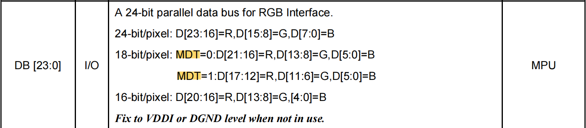

# RGB LCD application code details

* For more details [Doc](https://docs.espressif.com/projects/esp-idf/en/latest/esp32s3/api-reference/peripherals/lcd.html#rgb-interfaced-lcd).
* If the SPI interface is not required for configuration, the reference example project is located in the ESP-IDF [examples/peripherals/lcd/rgb_panel](https://github.com/espressif/esp-idf/tree/master/examples/peripherals/lcd/rgb_panel)
* If SPI is required (i.e. 3-line SPI+RGB), the reference example project is located in ESP-BSP [examples/display_lvgl_demos](https://github.com/espressif/esp-bsp/tree/master/examples/display_lvgl_demos)，In this example, the 480x480 LCD sub-board is "3-line SPI+RGB", while the 800x480 LCD sub-board is only "RGB"
* Take the common "3-line SPI+RGB" as an example to explain the specific configuration parameters in each stage of the code

## LCD initialize configuration

In this example, an IO expansion chip (TCA9554) is used to simulate SPI timing. **Users can also simulate SPI through hardware SPI or chip IO**.

```
#include "freertos/FreeRTOS.h"
#include "freertos/task.h"
#include "esp_io_expander_tca9554.h"`

/******************* Please modify according to the actual situation*******************/
#define LCD_CONFIG_DATA_LEN_MAX         (52)

#define Delay(t)        vTaskDelay(pdMS_TO_TICKS(t))
#define udelay(t)       esp_rom_delay_us(t)
#define CS(io, n)       BSP_ERROR_CHECK_RETURN_ERR(esp_io_expander_set_level(io, BSP_LCD_SPI_CS, n))
#define SCK(io, n)      BSP_ERROR_CHECK_RETURN_ERR(esp_io_expander_set_level(io, BSP_LCD_SPI_SCK, n))
#define SDO(io, n)      BSP_ERROR_CHECK_RETURN_ERR(esp_io_expander_set_level(io, BSP_LCD_SPI_SDO, n))
/******************* Please modify according to the actual situation*******************/

/**************************************************************************************************
 *
 * LCD Configuration Function
 *
 **************************************************************************************************/
static esp_err_t spi_write(esp_io_expander_handle_t io, uint16_t data)
{
    for (uint8_t n = 0; n < 9; n++) {
        if (data & 0x0100) {
            SDO(io, 1);
        } else {
            SDO(io, 0);
        }
        data = data << 1;

        SCK(io, 0);
        udelay(10);
        SCK(io, 1);
        udelay(10);
    }

    return ESP_OK;
}

static esp_err_t spi_write_cmd(esp_io_expander_handle_t io, uint16_t data)
{
    CS(io, 0);
    udelay(10);

    spi_write(io, (data & 0x00FF));  // In 3-line mode write data DC bit must be cleared to 0

    udelay(10);
    CS(io, 1);
    SCK(io, 0);
    SDO(io, 0);
    udelay(10);

    return ESP_OK;
}

static esp_err_t spi_write_data(esp_io_expander_handle_t io, uint16_t data)
{
    CS(io, 0);
    udelay(10);

    data &= 0x00FF;
    data |= 0x0100;     // In 3-line mode, write data DC bit must be set to 1
    spi_write(io, data);

    udelay(10);
    CS(io, 1);
    SCK(io, 0);
    SDO(io, 0);
    udelay(10);

    return ESP_OK;
}

/**
 * @brief LCD configuration data structure type
 *
 */
typedef struct {
    uint8_t cmd;            // LCD command
    uint8_t data[LCD_CONFIG_DATA_LEN_MAX];       // LCD data
    uint8_t data_bytes;     // Length of data in above data array; 0xFF = end of cmds.
} lcd_config_data_t;

const static lcd_config_data_t LCD_CONFIG_CMD[] = {
/******************* Please modify according to the actual situation *******************/
    {0xf0, {0x55, 0xaa, 0x52, 0x08, 0x00}, 5},
    {0xf6, {0x5a, 0x87}, 2},
    {0x11, {0x00}, 0},
    ...
/******************* Please modify according to the actual situation *******************/

    {0x00, {0x00}, 0xff},
};

static esp_err_t lcd_config(esp_io_expander_handle_t io_expander)
{
    BSP_ERROR_CHECK_RETURN_ERR(esp_io_expander_set_dir(io_expander, BSP_LCD_SPI_CS, IO_EXPANDER_OUTPUT));
    esp_io_expander_set_dir(io_expander, BSP_LCD_SPI_SCK, IO_EXPANDER_OUTPUT);
    esp_io_expander_set_dir(io_expander, BSP_LCD_SPI_SDO, IO_EXPANDER_OUTPUT);
    esp_io_expander_set_level(io_expander, BSP_LCD_SPI_CS, 1);
    esp_io_expander_set_level(io_expander, BSP_LCD_SPI_SCK, 1);
    esp_io_expander_set_level(io_expander, BSP_LCD_SPI_SDO, 1);

    for (uint8_t i = 0; LCD_CONFIG_CMD[i].data_bytes != 0xff; i++) {
        BSP_ERROR_CHECK_RETURN_ERR(spi_write_cmd(io_expander, LCD_CONFIG_CMD[i].cmd));
        for (uint8_t j = 0; j < LCD_CONFIG_CMD[i].data_bytes; j++) {
            BSP_ERROR_CHECK_RETURN_ERR(spi_write_data(io_expander, LCD_CONFIG_CMD[i].data[j]));
        }
    }
    vTaskDelay(pdMS_TO_TICKS(120));
    BSP_ERROR_CHECK_RETURN_ERR(spi_write_cmd(io_expander, 0x29));
    vTaskDelay(pdMS_TO_TICKS(20));

    return ESP_OK;
}
```

* The SPI timing simulated in this example is **Mode 0** (CPOL=0, CPHA=0). Users need to refer to the LCD driver IC datasheet to confirm
* Using the example template mainly requires the following modifications:

    1. `CS()、SCK()、SDO()` Macro: can be modified to chip IO to simulate SPI

    2. `LCD_CONFIG_CMD` Array: Modify according to the configuration data given by the screen factory, and modify the `LCD_CONFIG_DATA_LEN_MAX` Macro according to the maximum number of bytes

    3. `lcd_config()` Function: can be modified to chip IO to simulate SPI and set special operations (such as delay, etc.)

* For common st, ili, and gc series LCD driver ICs, there are two commands in the initialization configuration that need attention. Sometimes the color display is not normal because the following commands do not match the hardware:

    1. **COLCTRL（CDh)**: The **MDT** bit determines how many data lines are used by **18-bit RGB666**, as shown in the figure below

        <div align=center ></div>

        It needs to be set according to the specific hardware connection method, MDT=0(CDH=00): D[21:16]=R,D[13:8]=G,D[5:0]=B; MDT=1( CDH=08): D[17:12]=R,D[11:6]=G,D[5:0]=B

    2. **COLMOD（3Ah)**: The **VIPF[2:0]** bit determines the LCD color type (input data format), as shown in the figure below

        <div align=center ></div>

        It needs to be set according to the specific hardware connection method, 55/50=16-bit(RGB565); 66=18-bit(RGB666); 77 or default=24-bit(RGB888)

## Configure esp_lcd_panel

```
#include "driver/gpio.h"
#include "esp_lcd_panel_io.h"       // dependent header files
#include "esp_lcd_panel_ops.h"
#include "esp_lcd_panel_rgb.h"

/******************* Please modify according to the actual situation *******************/
#define BSP_LCD_VSYNC                   (GPIO_NUM_3)
#define BSP_LCD_HSYNC                   (GPIO_NUM_46)
#define BSP_LCD_DISP                    (GPIO_NUM_NC)
#define BSP_LCD_DE                      (GPIO_NUM_17)
#define BSP_LCD_PCLK                    (GPIO_NUM_9)
#define BSP_LCD_DATA0                   (GPIO_NUM_10)   // B3
#define BSP_LCD_DATA1                   (GPIO_NUM_11)   // B4
#define BSP_LCD_DATA2                   (GPIO_NUM_12)   // B5
#define BSP_LCD_DATA3                   (GPIO_NUM_13)   // B6
#define BSP_LCD_DATA4                   (GPIO_NUM_14)   // B7
#define BSP_LCD_DATA5                   (GPIO_NUM_21)   // G2
#define BSP_LCD_DATA6                   (GPIO_NUM_47)   // G3
#define BSP_LCD_DATA7                   (GPIO_NUM_48)   // G4
#define BSP_LCD_DATA8                   (GPIO_NUM_45)   // G5
#define BSP_LCD_DATA9                   (GPIO_NUM_38)   // G6
#define BSP_LCD_DATA10                  (GPIO_NUM_39)   // G7
#define BSP_LCD_DATA11                  (GPIO_NUM_40)   // R3
#define BSP_LCD_DATA12                  (GPIO_NUM_41)   // R4
#define BSP_LCD_DATA13                  (GPIO_NUM_42)   // R5
#define BSP_LCD_DATA14                  (GPIO_NUM_2)    // R6
#define BSP_LCD_DATA15                  (GPIO_NUM_1)    // R7
#define BSP_LCD_H_RES                   (480)
#define BSP_LCD_V_RES                   (480)
#define BSP_LCD_PIXEL_CLOCK_HZ          (18 * 1000 * 1000)
#define BSP_LCD_HSYNC_BACK_PORCH        (20)
#define BSP_LCD_HSYNC_FRONT_PORCH       (40)
#define BSP_LCD_HSYNC_PULSE_WIDTH       (13)
#define BSP_LCD_VSYNC_BACK_PORCH        (20)
#define BSP_LCD_VSYNC_FRONT_PORCH       (40)
#define BSP_LCD_VSYNC_PULSE_WIDTH       (15)
#define BSP_LCD_PCLK_ACTIVE_NEG         (false)
/******************* Please modify according to the actual situation *******************/

IRAM_ATTR static bool on_vsync_event(esp_lcd_panel_handle_t panel, const esp_lcd_rgb_panel_event_data_t *edata, void *user_ctx)
{
    BaseType_t need_yield = pdFALSE;

    // perform required operations here

    return (need_yield == pdTRUE);          // Returning true indicates that the Freertos scheduler needs to reschedule the task
}

esp_lcd_panel_handle_t bsp_lcd_init(void *arg)
{
    /* If you use "3-line SPI + RGB", you need to initialize the screen first */
    // BSP_ERROR_CHECK_RETURN_ERR(lcd_config((esp_io_expander_handle_t)arg));

    esp_lcd_panel_handle_t panel_handle = NULL;
    esp_lcd_rgb_panel_config_t panel_conf = {
        .clk_src = LCD_CLK_SRC_PLL160M,     // 设为 LCD_CLK_SRC_PLL160M 即可
        .psram_trans_align = 64,            // 设为 64 即可，即使不设置，内部默认为 64
        .data_width = 16,                   // 数据线宽度，表示并行传输的位数（见 LCD 硬件详解），目前仅支持如下两种:
                                            //    1. 若屏幕色彩类型为 16-bit RGB565，则设置为 16
                                            //    2. 若屏幕色彩类型为 8-bit RGB888，则设置为 8
        .disp_gpio_num = BSP_LCD_DISP       // 一般不使用该引脚，设为 -1 即可
        .de_gpio_num = BSP_LCD_DE,          // DE 信号引脚，仅在 LCD DE 模式（见 LCD 硬件详解）下使用，否则设为 -1
        .pclk_gpio_num = BSP_LCD_PCLK,      // PCLK 时钟引脚
        .vsync_gpio_num = BSP_LCD_VSYNC,    // VSYNC 帧同步信号引脚
        .hsync_gpio_num = BSP_LCD_HSYNC,    // HSYNC 行同步信号引脚
        .data_gpio_nums = {                 // D[15:0] 数据线，若为 8-bit RGB888，设置 D[7:0] 即可
            BSP_LCD_DATA0,
            BSP_LCD_DATA1,
            BSP_LCD_DATA2,
            BSP_LCD_DATA3,
            BSP_LCD_DATA4,
            BSP_LCD_DATA5,
            BSP_LCD_DATA6,
            BSP_LCD_DATA7,
            BSP_LCD_DATA8,
            BSP_LCD_DATA9,
            BSP_LCD_DATA10,
            BSP_LCD_DATA11,
            BSP_LCD_DATA12,
            BSP_LCD_DATA13,
            BSP_LCD_DATA14,
            BSP_LCD_DATA15,
        },
        .timings = {    // RGB 时序相关参数，需要根据屏厂给定的数据来设置
                        // 若没有，也可以查阅数据手册给定的范围，按照最小值大致设置一下，通常影响不大
            .pclk_hz = BSP_LCD_PIXEL_CLOCK_HZ,                  // PCLK 频率，需要大于数据手册给定的最小值，否则会闪白屏
            .h_res = BSP_LCD_H_RES,                             // 水平分辨率
            .v_res = BSP_LCD_V_RES,                             // 垂直分辨率
            .hsync_back_porch = BSP_LCD_HSYNC_BACK_PORCH,       // 水平后窗
            .hsync_front_porch = BSP_LCD_HSYNC_FRONT_PORCH,     // 水平前窗
            .hsync_pulse_width = BSP_LCD_HSYNC_PULSE_WIDTH,     // 水平脉宽
            .vsync_back_porch = BSP_LCD_VSYNC_BACK_PORCH,       // 垂直后窗
            .vsync_front_porch = BSP_LCD_VSYNC_FRONT_PORCH,     // 垂直前窗
            .vsync_pulse_width = BSP_LCD_VSYNC_PULSE_WIDTH,     // 垂直脉宽
            .flags.pclk_active_neg = BSP_LCD_PCLK_ACTIVE_NEG,   // true 表示 PCLK 下降沿有效，否则上升沿有效
        },
        .flags.fb_in_psram = 1,                                 // 设为 1 即可，由于 RGB 需要整帧 buffer 用于刷频，只能放在 PSRAM上
        // .flags.double_fb = 1,                                   // 1 表示使能内部双 buffer（整帧大小），否则仅单 buffer
        // .flags.refresh_on_demand = 1,                           // 0 表示内部自动刷新，即一帧传输完成后自动开始传输下一帧
                                                                // 1 表示开启手动刷新，即每帧都需要手动调用 esp_lcd_rgb_panel_refresh()
        // .bounce_buffer_size_px = 10 * BSP_LCD_H_RES,            // 设置 bounce buffer 的像素个数（内部会创建两个），见下面详述
    };
    BSP_ERROR_CHECK_RETURN_NULL(esp_lcd_new_rgb_panel(&panel_conf, &panel_handle));
    esp_lcd_rgb_panel_event_callbacks_t cbs = {
        .on_vsync = on_vsync_event,
    };
    esp_lcd_rgb_panel_register_event_callbacks(panel_handle, &cbs, NULL);   // 注册回调函数，每传输完一帧会调用一次
    esp_lcd_panel_reset(panel_handle);
    esp_lcd_panel_init(panel_handle);
#if ESP_IDF_VERSION >= ESP_IDF_VERSION_VAL(5, 0, 0)
    ESP_ERROR_CHECK(esp_lcd_panel_disp_on_off(panel_handle, true));         // 通过 disp_gpio_num 引脚控制屏幕开启
#else
    ESP_ERROR_CHECK(esp_lcd_panel_disp_off(panel_handle, false));
#endif
    return panel_handle;
}
```

* **Frame rate**: divided into interface frame rate, rendering frame rate and display frame rate

  1. **Interface frame rate** refers to the frame rate at which the RGB interface transmits data to the LCD driver IC for flashing the screen, which determines the upper limit of the screen display frame rate. The calculation formula is as follows:

    <div align=center >
    Interface frame rate = pclk_hz /(h_res + h_back_porch + h_front_porch + h_pulse_width) * (v_res + v_back_porch + v_front_porch + v_pulse_width)
    </div>

  2. **Rendering frame rate** refers to the frame rate that requires the CPU to calculate and render animation effects (or image codecs), such as the fps of LVGL real-time statistics, generally represented by the average frame rate of LVGL Music Demo statistics;

  3. **Display frame rate** refers to the frame rate of the animation effect actually displayed on the screen, indicating the fluency of the animation actually seen by the naked eye. It is determined by the interface frame rate and the rendering frame rate. The calculation formula is as follows:

    <div align=center >
    Display frame rate = min(interface frame rate, rendering frame rate)
    </div>

* **Bounce Buffer mechanism**: The driver defaults to transfer data from PSRAM to the peripheral via DMA to refresh the screen, while the Bounce buffer first transfers the data from PSRAM to the internal SRAM via memcpy through the specified size of the internal SRAM, and then transfers the data to the peripheral via DMA. In this way, the upper limit of PCLK setting can be increased, and the screen drift problem caused by operating flash can also be avoided, but it will increase CPU usage and reduce the actual display frame rate. For detailed explanation, see [Doc](https://docs.espressif.com/projects/esp-idf/en/latest/esp32s3/api-reference/peripherals/lcd.html#bounce-buffer-with-single-psram-frame-buffer)

* **`esp_lcd_panel_draw_bitmap()`**：Different from the 8080/SPI LCD driver, the RGB LCD refresh screen transfers the screen refresh data from the specified memory address to the frame buffer in PSRAM, and uses the memcpy method for memory transfer, which means that the data transfer is completed when the function call is completed. At this time, the original memory area can be modified (for example, let LVGL render and calculate), without waiting through the callback function

* **Anti-tearing solution**: Through double buffer, manual refresh mode and buffering-mode of LVGL, the anti-tearing solution can be realized, refer to [routine](https://github.com/espressif/esp-dev-kits/tree/master/esp32-s3-lcd-ev-board/examples/lvgl_demos)

* **Available API**: You can use the APIs in `panel_handle` and *esp_lcd_panel_ops.h* to operate the LCD, such as the refresh function `esp_lcd_panel_draw_bitmap()`. In addition, you can also call the RGB-specific API in *esp_lcd_panel_rgb.h*, such as setting the PCLK function `esp_lcd_rgb_panel_set_pclk()`

## Workaround for screen offset

- **configuration**
   - Improve PRAM and flash bandwidth, set flash to QIO 120M, PSRAM to Octal 120M
   - Enable `CONFIG_COMPILER_OPTIMIZATION_PERF`
   - Reduce data_cache_line_size to 32 Byte
   - Enable `CONFIG_SPIRAM_FETCH_INSTRUCTIONS` and `CONFIG_SPIRAM_RODATA`
   - Turn on `CONFIG_LCD_RGB_RESTART_IN_VSYNC.` It may cause a flashing screen and frame rate drop, which is generally not recommended, but you can try
- **Applications**
   - Write flash for a long time, such as continuous execution of OTA, NVS, and other write operations, which can be segmented and time-shared
   - (Master only) To write flash for a long time, such as continuously performing OTA, NVS, and other writing operations, you can set RGB to `Bounce Buffer` mode. See [Doc](https://docs.espressif.com/projects/esp-idf/en/latest/esp32s3/api-reference/peripherals/lcd.html#bounce-buffer-with-single-psram-frame-buffer). (`GDMA_ISR_IRAM_SAFE` cannot be enabled. Otherwise the Cache will report an error)
   - Short-term operation of flash causes drift, such as before and after wifi connection. You can call `esp_lcd_rgb_panel_set_pclk()` before the operation to reduce the PCLK (such as 6MHz) and delay about 20ms (the time for RGB to complete one frame) and then Increase PCLK to the original level after the operation, which may cause a short-term flashing white screen phenomenon
   - Enable `flags.refresh_on_demand` in `esp_lcd_rgb_panel_config_t,` manually refresh the screen by calling the `esp_lcd_rgb_panel_refresh()` interface, and reduce the frequency of refreshing the screen as much as possible while ensuring that the screen does not flash white
   - If unavoidable, you can call the `esp_lcd_rgb_panel_restart()` interface to reset the RGB timing to prevent permanent drift
