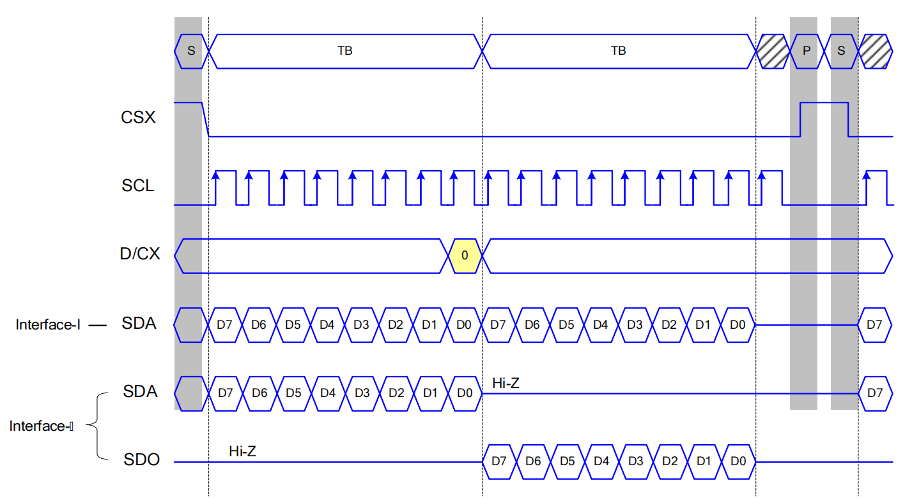

# SPI LCD application code

The reference example project is located in ESP-IDF [examples/peripherals/lcd/spi_lcd_touch](https://github.com/espressif/esp-idf/tree/release/v5.0/examples/peripherals/lcd/spi_lcd_touch/main ), the specific configuration parameters of each stage in the code are explained below.

## SPI bus initialization

If other devices are connected to the same bus as the LCD, it only needs to be initialized once.

```
#include "driver/spi_master.h"          // 依赖的头文件

spi_bus_config_t bus_cfg = {
    .sclk_io_num = PIN_NUM_LCD_SCLK,    // 连接 LCD SCK（SCL） 信号的 IO 编号
    .mosi_io_num = PIN_NUM_LCD_MOSI,    // 连接 LCD MOSI（SDO） 信号的 IO 编号，
    .miso_io_num = PIN_NUM_LCD_MISO,    // 连接 LCD MISO（SDI） 信号的 IO 编号，如果不需要从 LCD 读取数据，可以设为 -1
    .quadwp_io_num = -1,                // 必须设置且为 -1
    .quadhd_io_num = -1,                // 必须设置且为 -1
    .max_transfer_sz = LCD_H_RES * 10 * sizeof(uint16_t),
                                        // 此参数表示单次刷屏允许的最大字节数，若后续采用 LVGL ，则通常设置为 LVGL buffer 大小
};
ESP_ERROR_CHECK(spi_bus_initialize(SPI2_HOST, &bus_cfg, SPI_DMA_CH_AUTO));
                                        // 第 1 个参数表示使用的 SPI host ID，后续创建 SPI master 设备同样会用到
                                        // 第 3 个参数表示使用的 DMA 通道号，默认设置为 SPI_DMA_CH_AUTO 即可
```

1. If the LCD driver IC is configured as **Interface-I** type (see [LCD Hardware Details](./esp_lcd_hardware.md#interface-iii-mode)), only need to set `mosi_io_num` as its data line IO, Set `miso_io_num` to -1.

2. The `max_transfer_sz` parameter is only used to judge the size of the data transferred by the user inside the driver. If it exceeds the range, an error will be reported. It is not the size of the internally created buffer, and the SPI will only dynamically create a DMA buffer of the same size when transferring PSRAM memory because the SPI driver does not support the DMA transfer of PSRAM memory. **Attention**, the byte limit of a single screen refresh is not only limited by `max_transfer_sz` but also by the hardware register `SPI_LL_DATA_MAX_BIT_LEN` (different series of chips have different values, which can be found in ESP-IDF),* *In order to ensure the normal operation of the program**, their size relationship should satisfy `number of bytes per transfer <= max_transfer_sz <= 2^(SPI_LL_DATA_MAX_BIT_LEN - 3)`.

3. Currently esp_lcd does not support driving QSPI LCD, but it can be driven through SPI by itself.

## Create esp_lcd_panel_io

Create an esp_lcd panel io based on the initialized SPI host, each **esp_lcd_panel_io** corresponds to a **SPI device**.

```
#include "esp_lcd_panel_io.h"       // 依赖的头文件

static bool notify_lvgl_flush_ready(esp_lcd_panel_io_handle_t panel_io, esp_lcd_panel_io_event_data_t *edata, void *user_ctx)
{
    // 第 2 个参数无用，固定为 NULL
    // 第 3 个参数为 io_config 中传入的 user_ctx

    lv_disp_drv_t *disp_driver = (lv_disp_drv_t *)user_ctx;
    lv_disp_flush_ready(disp_driver);
    return false;                   // 无用，默认返回 false 即可
}

esp_lcd_panel_io_handle_t io_handle = NULL;
esp_lcd_panel_io_spi_config_t io_config = {
    .dc_gpio_num = PIN_NUM_LCD_DC,          // 连接 LCD DC（RS） 信号的 IO 编号，必须设置且 > -1
    .cs_gpio_num = PIN_NUM_LCD_CS,          // 连接 LCD CS 信号的 IO 编号
    .pclk_hz = LCD_PIXEL_CLOCK_HZ,          // SPI 的时钟频率，ESP 最高支持 80M（SPI_MASTER_FREQ_80M）
                                            // 需根据数据手册确定其最大值
    .lcd_cmd_bits = LCD_CMD_BITS,           // LCD 命令所需的二进制位数，应为 8 的整数倍，需根据数据手册确定
    .lcd_param_bits = LCD_PARAM_BITS,       // LCD 数据所需的二进制位数，应为 8 的整数倍，需根据数据手册确定
    .spi_mode = 0,                          // SPI 的模式，需根据数据手册确定，见后续详解
    .trans_queue_depth = 10,                // 此参数表示内部 SPI 设备的数据队列的深度，一般默认设为 10 即可
    .on_color_trans_done = notify_lvgl_flush_ready,
                                            // 此参数用于注册用户的回调函数，每次 SPI 传输完成就会调用
    .user_ctx = &disp_drv,                  // 此参数会被传入上面回调函数，作为第 3 个参数 user_ctx

    .flags = {                              // 以下均为 SPI 时序相关参数，0 表示否，1 表示是，需根据数据手册确定
        .cs_high_active = 0,                // CS 高电平使能，否则低电平使能
        .dc_low_on_data = 0,                // DC 低电平表示数据、高电平表示命令，否则高电平表示数据、低电平表示命令
        .lsb_first = 0,                     // 数据/命令传输时低位优先，否则高位优先
        .octal_mode = 0,                    // 8 线 SPI 模拟 8080 时序，一般不用设置
        .sio_mode = 0,                      // 通过一根数据线（MOSI）读写数据，对应于 Serial Interface I 型，否则为 II 型
    },
};
ESP_ERROR_CHECK(esp_lcd_new_panel_io_spi((esp_lcd_spi_bus_handle_t)LCD_HOST, &io_config, &io_handle));
                                            // 第 1 个参数为上一节初始化好的 SPI host ID
                                            // 第 3 个参数为创建好的 panel_io 设备
```

1. Currently esp_lcd does not support SPI three-wire (9-bit mode, see SPI LCD hardware details), so `lcd_cmd_bits` and `lcd_param_bits` must be integer multiples of 8 (8, 16, 24).

2. Based on panel_io, the following two APIs can be used to send **commands** and **data**:

    a. `esp_lcd_panel_io_tx_param()`: used to send commands and parameters related to LCD configuration, internally call `spi_device_polling_transmit()` to implement data transmission, this function will only return after the data transmission is completed

    b. `esp_lcd_panel_io_tx_color()`: Used to send commands and pixel data for LCD refresh, send commands through `spi_device_polling_transmit()`, and send pixel data through `spi_device_queue_trans()`, this function pushes the pixel buffer address into the queue ( Depth specified by `trans_queue_depth`) returns immediately on success. Therefore, **for subsequent programs that use LVGL**, `lv_disp_flush_ready()` must be called in the callback function and registered in `on_color_trans_done` of the configuration code above.

3. **Determine the configuration parameters according to the data sheet SPI timing:**

    The following figure is a part of the SPI function timing diagram in the ST7789 data sheet, and it will be used as an example to introduce how to configure each parameter.

    <div align=center ></div>

    a. `spi_mode`: depends on the CPOL (polarity) and CPHA (phase) of the SCK clock line. **CPOL** can be simply understood as the sampling edge of SCK after CS is enabled, 0 is the first transition edge, 1 is the second transition edge; **CPHA** can be simply understood as SCK idle level, 0 is low level, 1 is high level. Their corresponding relationship is shown in the following table:

    | spi_mode | CPOL | CPHA |
    | :------: | :--: | :--: |
    | 0        | 0    | 0    |
    | 1        | 0    | 1    |
    | 2        | 1    | 0    |
    | 3        | 1    | 1    |

    As can be seen from the figure above, SCL is sampled at the first transition edge after CS is enabled, so CPOL = 0, and the level of SCL is 0 when it is idle, so CPHA is 0, so `spi_mode = 0` can be obtained (generally 0 for most of the screen).

    b. `cs_high_active`: It can be seen from the above figure that it starts to operate when CS is pulled low, so `cs_high_active = 0` (generally most screens are 0).

    c. `dc_low_on_data`: It can be seen from the above figure that the DC line is 0 when sending commands, so `dc_low_on_data = 0` (generally most screens are 0)

    d. `lsb_first`: It can be seen from the above figure that the command or data is sent first (D7), so `lsb_first = 0` (generally most of the screens are 0)

    e. `sio_mode`: If the screen is configured as **Interface-I** type as shown in the figure above, its data reading and writing only uses one data line of SDA, at this time `sio_mode = 1`; if the screen The configuration is **Interface-II** type as shown in the figure above, its data is read using SDO, and written using SDA, at this time `sio_mode = 0` (generally most screens are 0).

# Configure esp_lcd_panel

See [ESP_LCD driver configuration](./esp_lcd_panel_config.md)
