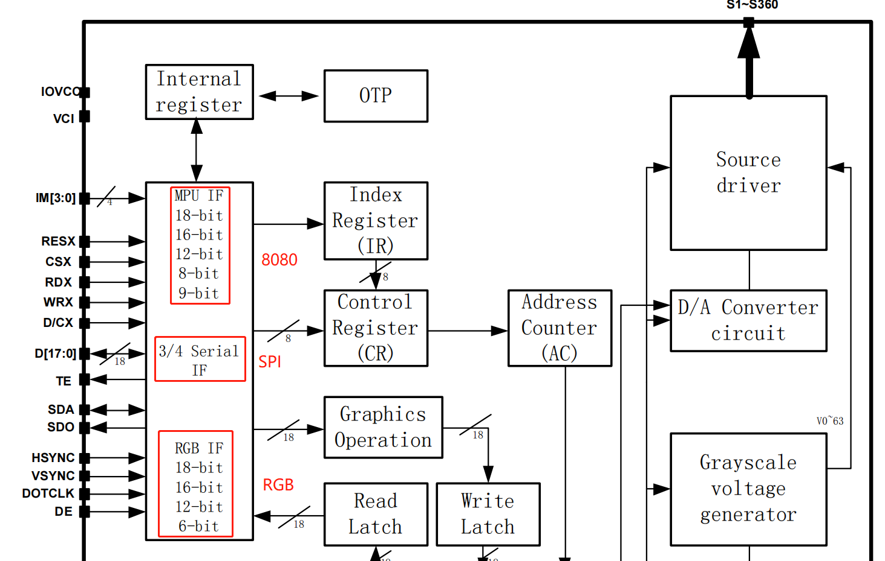
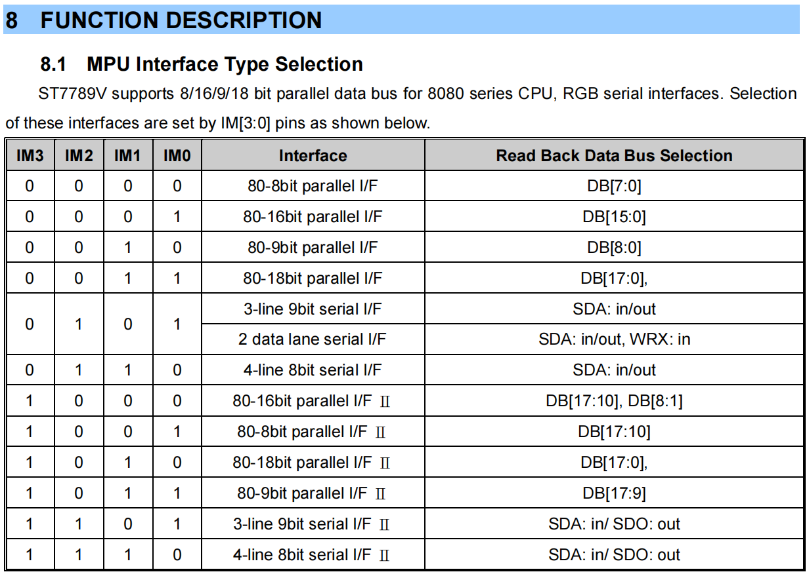
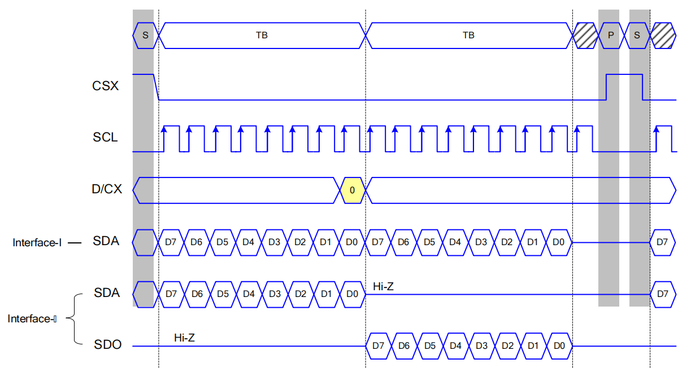
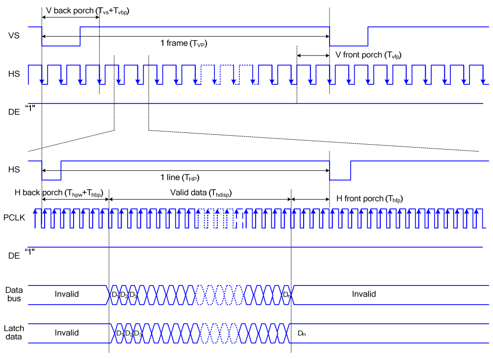
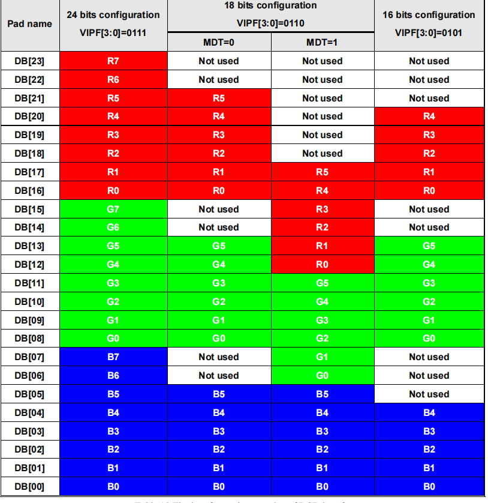

# LCD 硬件介绍

驱动 LCD 的第一步是了解它的接口类型，对于大部分常见的 LCD 驱动 IC，如 ST7789、GC9A01、ILI9341 等，这些芯片本身一般都会支持多种接口（如 SPI、8080 和 RGB），只是屏幕厂商在封装成 LCD 模组的时候会根据用户的要求或者按照惯例只留出其中一种接口（RGB 屏幕通常会也会留出 SPI 接口，参考[资料](https://focuslcds.com/3-wire-spi-parallel-rgb-interface-fan4213/)），如图 1 所示。

图1  GC9A01 功能框图

多数 LCD 的驱动 IC 最终使用哪种接口是通过 **IM[N:0]** 这几个引脚来决定的，如图 2 所示。大部分屏幕在内部已经定义好了 IM[N:0] ，但是也有一些屏幕会预留 IM[N:0] 以及所有的接口引脚，此时可以自行配置。

图2  ST7789 接口定义

因此，仅仅知道驱动 IC 无法判断屏幕的接口类型，在这种情况下可以通过原理图结合经验进行判断，如下：

* **（经验）屏幕分辨率与接口对应关系**:

|     小尺寸     |        中尺寸        |     大尺寸     |
| -------------- | -------------------- | -------------- |
| [1x1, 320x240] | （320x240，480x480） | [480x480，+∞） |
| SPI、I2C接口   | QSPI、8080接口       | RGB接口        |

* **LCD 引脚**：

    * 各接口通用：RST（RESX）、BL（LEDA、LEDK）
    * **SPI**: CS、SCK（SCL）、SDA（MOSI）、SDO（MISO）、DC（RS）、TE
    * **QSPI**: CS、SCK（SCL）、SDA（DATA0）、DATA1、DATA2、DATA3、TE
    * **8080**: CS（CSX）、RD（RDX）、WR（WRX）、DC（D/CX）、D[15:0]（D[7:0]）、TE
    * **RGB**: 3-line SPI、HSYNC、VSYNC、PCLK、DE、D[23:0]（D[17:0]、D[7:0]）

## SPI 接口

### 接口模式

图3  SPI 接口配置

#### Interface I/II 模式

* 区别在于**数据读取和写入是否仅用一根数据线**，如图 3、4 所示

图4  SPI Serial Interface I/II 读时序

* **Interface I** 模式表示仅用一根数据线进行读取和写入，此时，SPI 的 **MOSI** 对应于 **SDA**，且没有 **MISO**
* **Interface II** 模式表示用两根数据线分别进行读取和写入，此时，SPI 的 **MOSI** 对应于 **SDA**，SPI 的 **MISO** 对应于 **SDO**
* 通过 `esp_lcd_panel_io_spi_config_t` 的 `.flags.sio_mode` 可以选择对该模式进行设置

#### 3-line/4-line 模式

* 区别在于**是否有 DC（RS）信号线**，如图 3、5 所示

图5  SPI 3/4-line 写时序

* **3-line** 模式表示没有 DC 线来表示当前是命令还是数据，因此需要将 DC 信息作为 1 bit 数据进行传输，该模式有时也成为 **9-bit 模式**
* **4-line** 模式表示具有 DC 线
* 由于 3-line 模式的数据传输效率相对低很多，通常都采用 4-line 模式

## RGB 接口

大部分 RGB 屏幕采用 “三线 SPI + RGB” 接口形式，需要通过 SPI 接口对内部寄存器进行初始化配置，这类屏幕的详细信息请参考[资料](https://focuslcds.com/3-wire-spi-parallel-rgb-interface-fan4213/)。

### 接口模式

RGB 接口具有两种模式，即 **DE** 和 **HV** 模式，它们的区别在于**是否使用 DE 信号线**，一般可以通过命令进行配置选择。

* **DE 模式**：需要使用 VSYNC、HSYNC、PCLK（DOTCLK）、DE、D[X:0] 信号线，时序如下图所示。

图6  RGB DE 模式时序

* **HV 模式**：需要使用 VSYNC、HSYNC、PCLK（DOTCLK）、D[X:0] 信号线，时序如下图所示。

图7  RGB HV 模式时序

### 色彩（输入数据）类型

通常来说，RGB 接口支持多种色彩（输入数据）类型，包括 **RGB565**、**RGB666**、**RGB888**等，也可以通过命令进行配置。**需注意，色彩深度并不等于接口的数据线宽度**，如下图所示，18-bit 262K 和 6-bit 262K 均为 RGB565，但前者数据线宽度为 18，而后者为 6。

图8  RGB 输入数据类型

Note: 262K=RGB666、65K=RGB565，参考[资料](https://focuslcds.com/color-depth-65k-262k-16-7m-colors/)

因此，**命令配置需要与硬件端口保持一致**，比如某个 RGB LCD 屏幕仅有 D[17:0] 18 位数据线，需要确保命令配置其数据宽度 <= 18 位，并且需要注意硬件端口与色彩位的关系，如下图所示。

图9  RGB 色彩位与端口对应关系

目前仅有 ESP32-S3 支持 RGB 接口，且其仅支持输出 **16-bit RGB565** （或 8-bit RGB888）色彩类型，但是**通过硬件连接可以使其驱动 RGB666 或 RGB888 类型的屏幕**，参考[原理图](https://docs.espressif.com/projects/espressif-esp-dev-kits/zh_CN/latest/_static/esp32-s3-lcd-ev-board/schematics/SCH_ESP32-S3-LCD_Ev_Board_SUB2_V1.0_20220615.pdf)。
