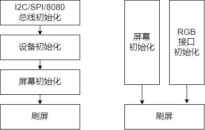

# ESP LCD 入门指南

## LCD 硬件介绍

见[文档](esp_lcd_hardware.md)。

## ESP_LCD 驱动介绍

ESP 的 LCD 驱动位于 **ESP-IDF** 下的 [components/esp_lcd](https://github.com/espressif/esp-idf/tree/master/components/esp_lcd)，目前仅存在于 **v4.4 及以上**版本中。**esp_lcd** 能够驱动 ESP 系列芯片所支持的 **I2C**、**SPI**、**8080** 以及 **RGB** 四种接口的 LCD 屏幕，各系列芯片所支持的 LCD 接口如下表所示。

|   SoC    |                          I2C 接口                           |                          SPI（QSPI）接口                           |                          8080 接口                          |                          RGB 接口                           |
| -------- | ----------------------------------------------------------- | ----------------------------------------------------------- | ----------------------------------------------------------- | ----------------------------------------------------------- |
| ESP32    |  |  |  |                                                             |
| ESP32-S2 |  |  |  |                                                             |
| ESP32-S3 |  |  |  |  |
| ESP32-C3 |  |  |                                                             |                                                             |

各接口的 LCD 驱动应用示例参考 ESP-IDF 下的 [examples/peripherals/lcd](https://github.com/espressif/esp-idf/tree/master/examples/peripherals/lcd)，这些示例目前仅存在于 **v5.0** 及以上版本中，因为 **v4.4** 中 esp_lcd 的 API 名称与高版本基本一致，所以同样可以参考上述示例（两者的 API 实现上有一些区别），**后续均以 ESP-IDF release/v5.0 分支为基础进行介绍**。

**特殊说明如下**：
* QSPI 接口没有正式的通用驱动及示例，目前仅针对 ST77903 的 QSPI 接口进行了适配，如用户有需求可以提供示例压缩包
* RGB 接口应用推荐使用 ESP32-S3R8 芯片，基于 ESP-IDF 最新的 **release/v5.0** 分支并打上[补丁](https://github.com/espressif/esp-dev-kits/tree/master/esp32-s3-lcd-ev-board/factory#idf-patch)
* RGB 接口驱动示例推荐参考 [esp32-s3-lcd-ev-board](https://docs.espressif.com/projects/espressif-esp-dev-kits/zh_CN/latest/esp32s3/esp32-s3-lcd-ev-board/user_guide.html) 开发板的 [bsp](https://github.com/espressif/esp-bsp/tree/master/esp32_s3_lcd_ev_board) 及[示例](https://github.com/espressif/esp-bsp/tree/master/examples/display_lvgl_demos)，该示例中 480x480 LCD 子板为 “3-line SPI + RGB”，而 800x480 LCD 子板仅为 “RGB”

## 硬件框架

图1  硬件框架（上图为非 RGB 接口，下图为 RGB 接口）

* **非 RGB 接口**：包含 I2C、SPI 以及 8080 接口，这类屏幕上的驱动 IC 通过**同一个外设接口**来传输**命令**和**刷屏**数据，并且内部使用一个整帧大小的显存（GRAM），ESP 只需要把刷屏数据（局部大小）传给驱动 IC，驱动 IC 会把数据保存到 GRAM 中，并按照自身的刷新速率把显示数据（整帧大小）显示到 LCD 面板上。
* **RGB 接口**：这类屏幕上的驱动 IC 只通过 RGB 接口传输刷屏数据，而命令是通过额外的 3-line SPI 接口传输，而且不使用 GRAM，需要 ESP 在自身内部维护至少一个整帧大小的 GRAM （默认放置于 PSRAM 内），通过 DMA 和 RGB 接口将 GRAM 内全部的**显示数据**传给屏幕上的驱动 IC，驱动 IC 用其直接驱动 LCD 面板工作。
* 两者对比：
    |   接口类型   | 驱动 IC 是否使用 GRAM |           数据传输方式            |
    | ------------ | --------------------- | --------------------------------- |
    | I2C/SPI/8080 | 是                    | 命令和数据使用同一接口            |
    | RGB          | 否                    | 命令使用 3-line SPI，数据使用 RGB |

## 软件流程

图2  软件流程（左图为非 RGB 接口，右图为 RGB 接口）

* **非 RGB 接口**：
    1. **总线初始化**：对接口总线进行配置和初始化，若同一总线挂载多个设备则仅需初始化一次
    2. **设备初始化**：基于接口总线新建并初始化设备，生成 `esp_lcd_panel_io_handle_t` 类型变量并提供 `esp_lcd_panel_io_tx_param()` 和 `esp_lcd_panel_io_tx_color()` API 供后续过程使用
    3. **屏幕初始化**：通过 **esp_lcd_panel_io** 对 LCD 屏幕的寄存器进行配置，生成 `esp_lcd_panel_handle_t` 类型变量并提供 `esp_lcd_panel_draw_bitmap()` 等 API 实现刷屏等操作
* **RGB 接口**：
    * **屏幕初始化**：由于该操作仅在 LCD 初始化时进行一次，且对通信速率要求不高，一般使用 IO（ESP 或 IO 扩展芯片）模拟 SPI 进行实现
    * **接口初始化**：对 RGB 接口进行配置和初始化，创建 `esp_lcd_panel_handle_t` 类型变量并提供 `esp_lcd_panel_draw_bitmap()` 等 API 实现刷屏等操作

## 应用代码详解
* [SPI LCD 应用代码详解](./esp_lcd_spi.md)
* 8080 LCD 应用代码详解（待更新）
* [RGB LCD 应用代码详解](./esp_lcd_rgb.md)

## 常见问题

### 上电花屏
* 具体问题描述见[链接](https://www.cnblogs.com/linhaostudy/p/9579829.html)
* 解决方法：背光延时开启

### 画面撕裂
* 具体问题描述见[链接](https://cloud.tencent.com/developer/article/1339560)
* 解决方法：
    * RGB 接口：通过多 buffer 以及内部同步机制可以避免，例程参考 [display_lvgl_demos](https://github.com/espressif/esp-bsp/tree/master/examples/display_lvgl_demos)
    *
