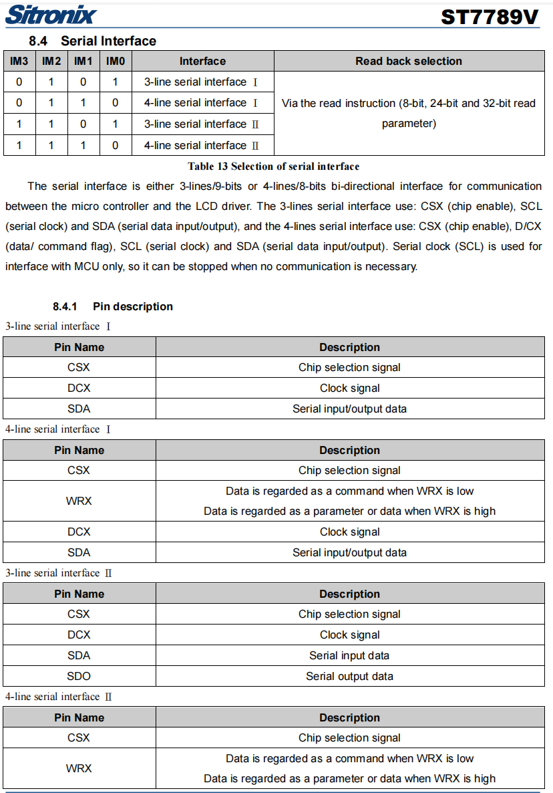
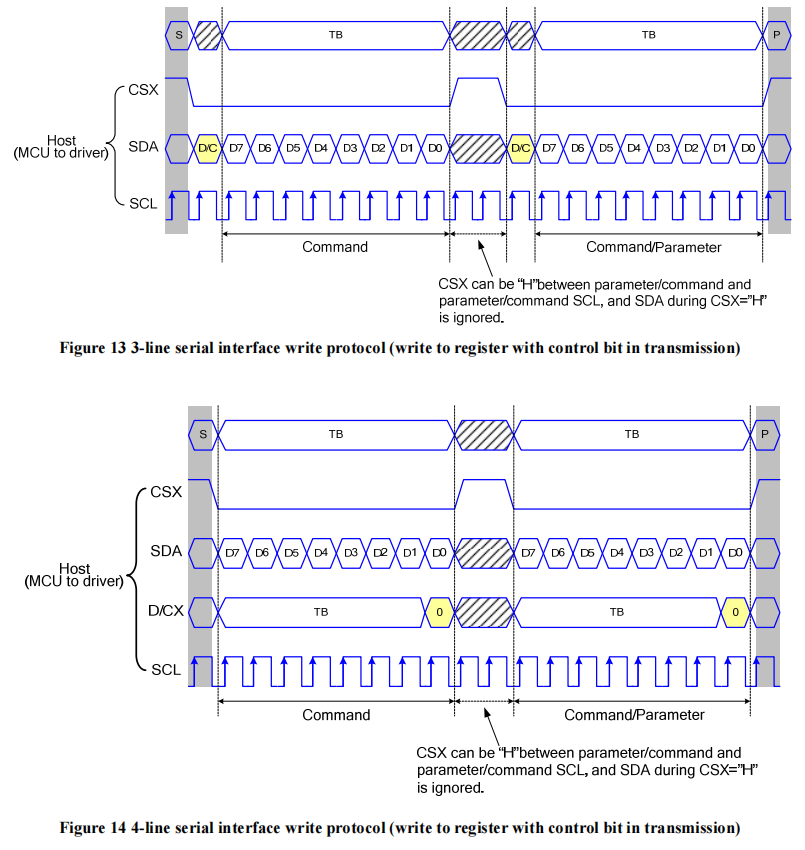
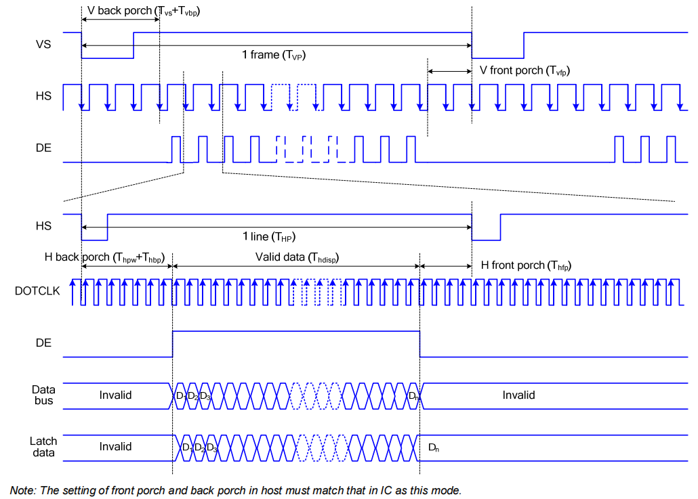
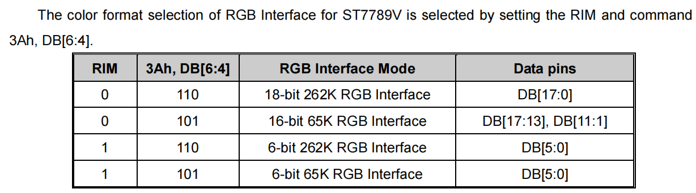

# LCD hardware details
TThe first step to driving an LCD is to understand its interface type. Most common LCD driver ICs, such as ST7789, GC9A01, ILI9341, etc., generally support multiple interfaces (such as SPI, 8080, and RGB). When the manufacturer packs it into an LCD module, only one of the interfaces will be reserved according to the customer's requirements or by convention (the RGB screen will usually also reserve the SPI interface), refer to [data](https://focuslcds.com/3 -wire-spi-parallel-rgb-interface-fan4213/)), as shown in Figure 1. 

 

Figure 1. GC9A01 functional block diagram

Which interface the driver IC finally uses is determined by the four pins **IM[3:0]**, as shown in Figure 2. Most screens have defined IM[3:0] internally, but some reserve IM[3:0] and all interface pins, which can be configured by themselves.

驱动 IC 最终使用哪种接口是通过 **IM[3:0]** 这 4 个引脚来决定的，如图 2 所示。大部分屏幕在内部已经定义好了 IM[3:0] ，但是也有一些屏幕会预留 IM[3:0] 以及所有的接口引脚，此时可以自行配置。

Figure 2. ST7789 interface definition

Therefore, One cannot judge the screen's interface type by knowing the driver IC. Reading  schematic diagrams and previous experience using LCDs can help you determine the interface, as follows:

* **(Experience) Correspondence between screen resolution and interface**

|     Small size        |        Medium size    |     Large size       |
| --------------------- | --------------------- |--------------------- |
| [1x1, 320x240]        | 320x240，480x480）     | [480x480，+ ∞）      |
| SPI or I2C interface  | 8080 interface        | RGB interface        |

* **LCD pins**：

    * Common to all interfaces：RST（RESX）reset
    * **SPI**: Usually have:   CS、SCK（SCL）、SDA（MOSI）、SDO（MISO） 、RS（WR）
    * **8080**: Usually have: CS（CSX）、RD（RDX）、WR（WRX）、DC（D/CX）、D[15:0]（D[7:0]）
    * **RGB**: Usually contain: 三线 SPI、HSYNC、VSYNC、PCLK、DE、D[23:0]（D[17:0]）

# SPI interface

## Interface mode

Figure 3.  SPI interface configuration

### Interface I/II model

* The difference lies in **Whether only one data line is used for data reading and writing**，as shown in Figure 3 and 4.

Figure 4.  SPI Serial Interface I/II read timing

* **Interface I** mode means only one data line is used for reading and writing, at this time, **MOSI** of SPI corresponds to **SDA**, and there is no **MISO**
* **Interface II** The mode means that two data lines are used to read and write respectively. At this time, **MOSI** of SPI corresponds to **SDA**, and **MISO** of SPI corresponds to **SDO**
* for choosing mode select `.flags.sio_mode` in `esp_lcd_panel_io_spi_config_t`

### 3-line/4-line mode

* The difference lies in **whether there is a DC (RS) signal line**, as shown in Figure 3 and 5 

Figure 5.  SPI 3/4-line write timing

* **3-line** mode means that there is no DC line to indicate whether it is a command or data, so the DC information needs to be transmitted as 1-bit data, and this mode sometimes becomes **9-bit mode**
* **4-line** mode means having a DC line, `esp_lcd` currently only supports this mode

# RGB interface

## Interface mode

The RGB interface has two modes, namely, **DE** and **HV**. The difference is whether to use the DE signal line**, which can be configured through commands.

* **DE mode**: Need to use VSYNC, HSYNC, PCLK (DOTCLK), DE, and D[X:0] signal lines. The timing is shown in the figure below.

Figure 6.  RGB DE mode timing

* **HV mode**: Need to use VSYNC, HSYNC, PCLK (DOTCLK), and D[X:0] signal lines. The timing is shown in the figure below.

Figure 7.  RGB HV mode timing

## Color(input data) type

Generally speaking, the RGB interface supports multiple color (input data) types, including **RGB565**, **RGB666**, **RGB888**, etc., and can also be configured through commands, as shown in the figure below.

Figure 8.  RGB input data type

Note: 262K=RGB666、65K=RGB565，reference [data](https://focuslcds.com/color-depth-65k-262k-16-7m-colors/)

Therefore, **command configuration must be consistent with the hardware port**. For example, if an RGB LCD screen only has D[17:0] 18-bit data line, you need to ensure that the data width of the command configuration is <= 18 bits.

Currently, only ESP32-S3 supports RGB interface, and it only supports output **16-bit RGB565** (or 8-bit RGB888) color type but **it can drive RGB666 or RGB888 type of screen through hardware connection* *, refer to [schematic](https://github.com/espressif/esp-dev-kits/blob/master/docs/_static/schematics/esp32-s3-lcd-ev-board/SCH_ESP32-S3-LCD_Ev_Board_SUB3_V1.0_20220617.pdf).
