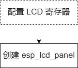

# ESP_LCD driver introduction

ESP's LCD driver is located in [components/esp_lcd](https://github.com/espressif/esp-idf/tree/master/components/esp_lcd) under **ESP-IDF**, currently only exists in **release /v4.4 and above** versions. **esp_lcd** can drive LCD screens with four interfaces supported by ESP series chips: **I2C**, **SPI**, **8080**, and **RGB**. The LCD screens are supported by each series of chips. The interface is shown in the table below.

|   SoC    |                          I2C interface                          |                          SPI interface                           |                          8080 interface                        |                          RGB interface                         |
| -------- | ----------------------------------------------------------- | ----------------------------------------------------------- | ----------------------------------------------------------- | ----------------------------------------------------------- |
| ESP32    |  |  |  |                                                             |
| ESP32-S2 |  |  |  |                                                             |
| ESP32-S3 |  |  |  |  |
| ESP32-C3 |  |  |                                                             |                                                             |

Examples of each interface of LCD driver application, refer to [examples/peripherals/lcd](https://github.com/espressif/esp-idf/tree/master/examples/peripherals/lcd) under ESP-IDF. These examples currently only exist in **release/v5.0** and above versions. The API name of esp_lcd in **release/v4.4** is basically the same as the higher version, so you can also refer to the above examples (there are some differences in the API implementation) and **subsequent will use ESP-IDF release/5.0**.

Since the driving principle of the RGB LCD screen is fundamentally different from that of other interface screens, the following will introduce separately according to **non-RGB interface** and **RGB interface**

## Non RGB interface

### Hardware framework

Figure 1. Non-RGB interface hardware framework

Including I2C, SPI, and 8080 interfaces, the driver IC on this type of screen uses a whole frame size of video memory GRAM internally, and the ESP only needs to transfer **swipe data** (partial size) to the driver IC and the driver IC will transfer the data Save it to the video memory, and display **display data** (full frame size) on the screen according to its own refresh rate.

### Software process

Figure 2. Non-RGB interface software flow

1. **Initialize the bus**: configure and initialize the interface bus; if multiple devices are mounted on the same bus, it only needs to be initialized once
2. **Create esp_lcd_panel_io**: Create a new device based on the interface bus, generate `esp_lcd_panel_io_handle_t` type variables, and provide `esp_lcd_panel_io_tx_param()` and `esp_lcd_panel_io_tx_color()` APIs for subsequent use
3. **Configure esp_lcd_panel**: Configure the registers of the LCD screen through **esp_lcd_panel_io**, generate `esp_lcd_panel_handle_t` type variables and provide APIs such as `esp_lcd_panel_draw_bitmap()` to realize screen refresh and other operations

### Code

* [Detailed explanation of SPI LCD application code](./esp_lcd_spi.md)
* Detailed explanation of 8080 LCD application code (in progress)

## RGB interface

### Hardware framework

Figure 3. RGB interface hardware framework

The drive IC on this type of screen does not use the video memory GRAM. The ESP maintains at least one full frame size GRAM in its own interior (placed in the PSRAM by default), transmits all the screen brushing data in the GRAM to the drive IC on the screen through DMA and RGB interfaces, and the drive IC directly drives the display circuit to work as display data.

### Software process

Figure 4. RGB interface software flow

1. **Configure LCD registers** (optional): Most RGB screens use the "three wire SPI+RGB" interface, and the internal registers need to be initialized through the SPI interface. For details of such screens, please refer to [Materials](https://focuslcds.com/3-wire-spi-parallel-rgb-interface-fan4213/). Since this operation is only performed once during LCD initialization and does not require high communication rate, IO (ESP or IO expansion chip) can be used to simulate SPI.
2. **Create esp_ lcd_ Panel**: Configure the parameters of the RGB interface of ESP, and create 'esp_ lcd_ panel_ handle_ T' type variable and provide 'esp_ lcd_ panel_ draw_ Bitmap()' and other APIs enable screen brushing and other operations

### Code details

[RGB LCD applictaion code details](./esp_lcd_rgb.md)
