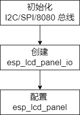
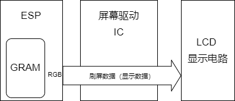

# ESP_LCD 驱动介绍
***

ESP 的 LCD 驱动位于 **ESP-IDF** 下的 [components/esp_lcd](https://github.com/espressif/esp-idf/tree/master/components/esp_lcd)，目前仅存在于 **release/v4.4 及以上**版本中。**esp_lcd** 能够驱动 ESP 系列芯片所支持的 **I2C**、**SPI**、**8080** 以及 **RGB** 四种接口的 LCD 屏幕，各系列芯片所支持的 LCD 接口如下表所示。

|   SoC    |                          I2C 接口                           |                          SPI 接口                           |                          8080 接口                          |                          RGB 接口                           |
| -------- | ----------------------------------------------------------- | ----------------------------------------------------------- | ----------------------------------------------------------- | ----------------------------------------------------------- |
| ESP32    |  |  |  |                                                             |
| ESP32-S2 |  |  |  |                                                             |
| ESP32-S3 |  |  |  |  |
| ESP32-C3 |  |  |                                                             |                                                             |

各接口的 LCD 驱动应用示例参考 ESP-IDF 下的 [examples/peripherals/lcd](https://github.com/espressif/esp-idf/tree/master/examples/peripherals/lcd)，这些示例目前仅存在于 **release/v5.0** 及以上版本中，因为 **release/v4.4** 中 esp_lcd 的 API 名称与高版本基本一致，所以同样可以参考上述示例（两者的 API 实现上有一些区别），**后续均以 ESP-IDF release/5.0 为基础进行介绍**。

由于 RGB LCD 屏幕的驱动原理与其他接口屏幕有本质差异，下面将按照 **非 RGB 接口**和 **RGB 接口**分别进行介绍：

## 非 RGB 接口
***

### 硬件框架

图1  非 RGB 接口硬件框架

包含 I2C、SPI 以及 8080 接口，这类屏幕上的驱动 IC 内部使用一个整帧大小的显存 GRAM，ESP 只需要把**刷屏数据**（局部大小）传给驱动 IC，驱动 IC 会把数据保存到显存中，并按照自身的刷新速率把**显示数据**（整帧大小）显示到屏幕上。

### 软件流程

图2  非 RGB 接口软件流程

1. **初始化总线**：对接口总线进行配置和初始化，若同一总线挂载多个设备则仅需初始化一次
2. **创建 esp_lcd_panel_io**：基于接口总线新建设备，生成 `esp_lcd_panel_io_handle_t` 类型变量并提供 `esp_lcd_panel_io_tx_param()` 和 `esp_lcd_panel_io_tx_color()` API 供后续过程使用
3. **配置 esp_lcd_panel**：通过 **esp_lcd_panel_io** 对 LCD 屏幕的寄存器进行配置，生成 `esp_lcd_panel_handle_t` 类型变量并提供 `esp_lcd_panel_draw_bitmap()` 等 API 实现刷屏等操作

## RGB 接口
***

### 硬件框架

图3  RGB 接口硬件框架

这类屏幕上的驱动 IC 不使用显存 GRAM，ESP 在自身内部维护至少一个整帧大小的 GRAM （默认放置于 PSRAM 内），通过 DMA 和 RGB 接口将 GRAM 内全部的刷屏数据传给屏幕上的驱动 IC，驱动 IC 将其作为显示数据直接驱动显示电路工作。

### 软件流程

图4  RGB 接口软件流程

1. **配置 LCD 寄存器**（可选）：大部分 RGB 屏幕采用 “三线 SPI + RGB” 接口形式，需要通过 SPI 接口对内部寄存器进行初始化配置，这类屏幕的详细信息请参考[资料](https://focuslcds.com/3-wire-spi-parallel-rgb-interface-fan4213/)。由于该操作仅在 LCD 初始化时进行一次，且对通信速率要求不高，可以使用 IO（ESP 或 IO 扩展芯片）模拟 SPI 进行实现。
2. **创建 esp_lcd_panel**：对 ESP 的 RGB 接口进行参数配置，创建 `esp_lcd_panel_handle_t` 类型变量并提供 `esp_lcd_panel_draw_bitmap()` 等 API 实现刷屏等操作
