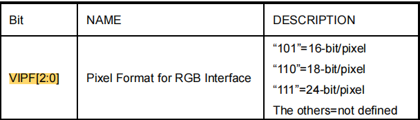

# RGB LCD 应用代码详解
***

* 如果不需要 SPI 接口进行配置的话，参考的示例工程位于 ESP-IDF 中 [examples/peripherals/lcd/rgb_panel](https://github.com/espressif/esp-idf/tree/master/examples/peripherals/lcd/rgb_panel)
* 如果需要 SPI 的话（即 3-line SPI + RGB），参考的示例工程位于 ESP-BSP 中 [examples/display_lvgl_demos](https://github.com/espressif/esp-bsp/tree/master/examples/display_lvgl_demos)，该示例中 480x480 LCD 子板为 “3-line SPI + RGB”，而 800x480 LCD 子板仅为 “RGB”
* 下面以常见的 “3-line SPI + RGB” 为例，对代码中各阶段具体的配置参数进行讲解

## LCD 初始化配置
***

本示例采用了 IO 扩展芯片（TCA9554）来模拟 SPI 时序，**用户也可以通过硬件 SPI 或芯片 IO 模拟 SPI**。

```
#include "freertos/FreeRTOS.h"
#include "freertos/task.h"
#include "esp_io_expander_tca9554.h"`

/******************* 请根据实际情况修改 *******************/
#define LCD_CONFIG_DATA_LEN_MAX         (52)

#define Delay(t)        vTaskDelay(pdMS_TO_TICKS(t))
#define udelay(t)       esp_rom_delay_us(t)
#define CS(io, n)       BSP_ERROR_CHECK_RETURN_ERR(esp_io_expander_set_level(io, BSP_LCD_SPI_CS, n))
#define SCK(io, n)      BSP_ERROR_CHECK_RETURN_ERR(esp_io_expander_set_level(io, BSP_LCD_SPI_SCK, n))
#define SDO(io, n)      BSP_ERROR_CHECK_RETURN_ERR(esp_io_expander_set_level(io, BSP_LCD_SPI_SDO, n))
/******************* 请根据实际情况修改 *******************/

/**************************************************************************************************
 *
 * LCD Configuration Function
 *
 **************************************************************************************************/
static esp_err_t spi_write(esp_io_expander_handle_t io, uint16_t data)
{
    for (uint8_t n = 0; n < 9; n++) {
        if (data & 0x0100) {
            SDO(io, 1);
        } else {
            SDO(io, 0);
        }
        data = data << 1;

        SCK(io, 0);
        udelay(10);
        SCK(io, 1);
        udelay(10);
    }

    return ESP_OK;
}

static esp_err_t spi_write_cmd(esp_io_expander_handle_t io, uint16_t data)
{
    CS(io, 0);
    udelay(10);

    spi_write(io, (data & 0x00FF));  // 3-line 模式下写数据 DC 位要清 0

    udelay(10);
    CS(io, 1);
    SCK(io, 0);
    SDO(io, 0);
    udelay(10);

    return ESP_OK;
}

static esp_err_t spi_write_data(esp_io_expander_handle_t io, uint16_t data)
{
    CS(io, 0);
    udelay(10);

    data &= 0x00FF;
    data |= 0x0100;     // 3-line 模式下写数据 DC 位要置 1
    spi_write(io, data);

    udelay(10);
    CS(io, 1);
    SCK(io, 0);
    SDO(io, 0);
    udelay(10);

    return ESP_OK;
}

/**
 * @brief LCD configuration data structure type
 *
 */
typedef struct {
    uint8_t cmd;            // LCD command
    uint8_t data[LCD_CONFIG_DATA_LEN_MAX];       // LCD data
    uint8_t data_bytes;     // Length of data in above data array; 0xFF = end of cmds.
} lcd_config_data_t;

const static lcd_config_data_t LCD_CONFIG_CMD[] = {
/******************* 请根据实际情况修改 *******************/
    {0xf0, {0x55, 0xaa, 0x52, 0x08, 0x00}, 5},
    {0xf6, {0x5a, 0x87}, 2},
    {0x11, {0x00}, 0},
    ...
/******************* 请根据实际情况修改 *******************/

    {0x00, {0x00}, 0xff},
};

static esp_err_t lcd_config(esp_io_expander_handle_t io_expander)
{
    BSP_ERROR_CHECK_RETURN_ERR(esp_io_expander_set_dir(io_expander, BSP_LCD_SPI_CS, IO_EXPANDER_OUTPUT));
    esp_io_expander_set_dir(io_expander, BSP_LCD_SPI_SCK, IO_EXPANDER_OUTPUT);
    esp_io_expander_set_dir(io_expander, BSP_LCD_SPI_SDO, IO_EXPANDER_OUTPUT);
    esp_io_expander_set_level(io_expander, BSP_LCD_SPI_CS, 1);
    esp_io_expander_set_level(io_expander, BSP_LCD_SPI_SCK, 1);
    esp_io_expander_set_level(io_expander, BSP_LCD_SPI_SDO, 1);

    for (uint8_t i = 0; LCD_CONFIG_CMD[i].data_bytes != 0xff; i++) {
        BSP_ERROR_CHECK_RETURN_ERR(spi_write_cmd(io_expander, LCD_CONFIG_CMD[i].cmd));
        for (uint8_t j = 0; j < LCD_CONFIG_CMD[i].data_bytes; j++) {
            BSP_ERROR_CHECK_RETURN_ERR(spi_write_data(io_expander, LCD_CONFIG_CMD[i].data[j]));
        }
    }
    vTaskDelay(pdMS_TO_TICKS(120));
    BSP_ERROR_CHECK_RETURN_ERR(spi_write_cmd(io_expander, 0x29));
    vTaskDelay(pdMS_TO_TICKS(20));

    return ESP_OK;
}
```

* 本示例模拟的 SPI 时序为**模式 0**（CPOL=0,CPHA=0），用户需要查阅 LCD 驱动 IC 数据手册来确认

* 使用示例模板主要需要进行如下修改：

    1. `CS()、SCK()、SDO()` 宏：可以修改为芯片 IO 来模拟 SPI

    2.  `LCD_CONFIG_CMD` 数组：根据屏厂给定的配置数据进行修改，同时根据最大字节数修改 `LCD_CONFIG_DATA_LEN_MAX` 宏

    3. `lcd_config()` 函数：可以修改为芯片 IO 来模拟 SPI，设置特殊操作（如延时等）

* 对于常见 st、ili、gc 系列 LCD 驱动 IC，初始化配置中有两个命令需要注意下，有时颜色显示不正常可能是因为下列命令与硬件不符合导致的：

    1. **COLCTRL（CDh）**：其中 **MDT** 位决定了 **18-bit RGB666** 采用了几根数据线，如下图所示

        <div align=center ></div>

        需要结合具体的硬件连接方式进行设置，MDT=0(CDH=00): D[21:16]=R,D[13:8]=G,D[5:0]=B; MDT=1(CDH=08): D[17:12]=R,D[11:6]=G,D[5:0]=B

    2. **COLMOD（3Ah）**：其中 **VIPF[2:0]** 位决定了 LCD 的颜色类型（输入数据格式），如下图所示

        <div align=center ></div>

        需要结合具体的硬件连接方式进行设置，55/50=16-bit(RGB565);66=18-bit(RGB666);77或默认=24-bit(RGB888)

## 配置 esp_lcd_panel
***

```
#include "driver/gpio.h"
#include "esp_lcd_panel_io.h"       // 依赖的头文件
#include "esp_lcd_panel_ops.h"
#include "esp_lcd_panel_rgb.h"

/******************* 请根据实际情况修改 *******************/
#define BSP_LCD_VSYNC                   (GPIO_NUM_3)
#define BSP_LCD_HSYNC                   (GPIO_NUM_46)
#define BSP_LCD_DISP                    (GPIO_NUM_NC)
#define BSP_LCD_DE                      (GPIO_NUM_17)
#define BSP_LCD_PCLK                    (GPIO_NUM_9)
#define BSP_LCD_DATA0                   (GPIO_NUM_10)   // B3
#define BSP_LCD_DATA1                   (GPIO_NUM_11)   // B4
#define BSP_LCD_DATA2                   (GPIO_NUM_12)   // B5
#define BSP_LCD_DATA3                   (GPIO_NUM_13)   // B6
#define BSP_LCD_DATA4                   (GPIO_NUM_14)   // B7
#define BSP_LCD_DATA5                   (GPIO_NUM_21)   // G2
#define BSP_LCD_DATA6                   (GPIO_NUM_47)   // G3
#define BSP_LCD_DATA7                   (GPIO_NUM_48)   // G4
#define BSP_LCD_DATA8                   (GPIO_NUM_45)   // G5
#define BSP_LCD_DATA9                   (GPIO_NUM_38)   // G6
#define BSP_LCD_DATA10                  (GPIO_NUM_39)   // G7
#define BSP_LCD_DATA11                  (GPIO_NUM_40)   // R3
#define BSP_LCD_DATA12                  (GPIO_NUM_41)   // R4
#define BSP_LCD_DATA13                  (GPIO_NUM_42)   // R5
#define BSP_LCD_DATA14                  (GPIO_NUM_2)    // R6
#define BSP_LCD_DATA15                  (GPIO_NUM_1)    // R7
#define BSP_LCD_H_RES                   (480)
#define BSP_LCD_V_RES                   (480)
#define BSP_LCD_PIXEL_CLOCK_HZ          (18 * 1000 * 1000)
#define BSP_LCD_HSYNC_BACK_PORCH        (20)
#define BSP_LCD_HSYNC_FRONT_PORCH       (40)
#define BSP_LCD_HSYNC_PULSE_WIDTH       (13)
#define BSP_LCD_VSYNC_BACK_PORCH        (20)
#define BSP_LCD_VSYNC_FRONT_PORCH       (40)
#define BSP_LCD_VSYNC_PULSE_WIDTH       (15)
#define BSP_LCD_PCLK_ACTIVE_NEG         (false)
/******************* 请根据实际情况修改 *******************/

IRAM_ATTR static bool on_vsync_event(esp_lcd_panel_handle_t panel, const esp_lcd_rgb_panel_event_data_t *edata, void *user_ctx)
{
    BaseType_t need_yield = pdFALSE;

    // 此处执行需要的操作

    return (need_yield == pdTRUE);          // 返回 ture 表示需要 Freertos 调度器重新调度任务
}

esp_lcd_panel_handle_t bsp_lcd_init(void *arg)
{
    /* 如果采用 “3-line SPI + RGB” 需要先对屏幕进行初始化配置 */
    // BSP_ERROR_CHECK_RETURN_ERR(lcd_config((esp_io_expander_handle_t)arg));

    esp_lcd_panel_handle_t panel_handle = NULL;
    esp_lcd_rgb_panel_config_t panel_conf = {
        .clk_src = LCD_CLK_SRC_PLL160M,     // 设为 LCD_CLK_SRC_PLL160M 即可
        .psram_trans_align = 64,            // 设为 64 即可，即使不设置，内部默认为 64
        .data_width = 16,                   // 数据线宽度，表示并行传输的位数（见 LCD 硬件详解），目前仅支持如下两种:
                                            //    1. 若屏幕色彩类型为 16-bit RGB565，则设置为 16
                                            //    2. 若屏幕色彩类型为 8-bit RGB888，则设置为 8
        .disp_gpio_num = BSP_LCD_DISP       // 一般不使用该引脚，设为 -1 即可
        .de_gpio_num = BSP_LCD_DE,          // DE 信号引脚，仅在 LCD DE 模式（见 LCD 硬件详解）下使用，否则设为 -1
        .pclk_gpio_num = BSP_LCD_PCLK,      // PCLK 时钟引脚
        .vsync_gpio_num = BSP_LCD_VSYNC,    // VSYNC 帧同步信号引脚
        .hsync_gpio_num = BSP_LCD_HSYNC,    // HSYNC 行同步信号引脚
        .data_gpio_nums = {                 // D[15:0] 数据线，若为 8-bit RGB888，设置 D[7:0] 即可
            BSP_LCD_DATA0,
            BSP_LCD_DATA1,
            BSP_LCD_DATA2,
            BSP_LCD_DATA3,
            BSP_LCD_DATA4,
            BSP_LCD_DATA5,
            BSP_LCD_DATA6,
            BSP_LCD_DATA7,
            BSP_LCD_DATA8,
            BSP_LCD_DATA9,
            BSP_LCD_DATA10,
            BSP_LCD_DATA11,
            BSP_LCD_DATA12,
            BSP_LCD_DATA13,
            BSP_LCD_DATA14,
            BSP_LCD_DATA15,
        },
        .timings = {    // RGB 时序相关参数，需要根据屏厂给定的数据来设置
                        // 若没有，也可以查阅数据手册给定的范围，按照最小值大致设置一下，通常影响不大
            .pclk_hz = BSP_LCD_PIXEL_CLOCK_HZ,                  // PCLK 频率，需要大于数据手册给定的最小值，否则会闪白屏
            .h_res = BSP_LCD_H_RES,                             // 水平分辨率
            .v_res = BSP_LCD_V_RES,                             // 垂直分辨率
            .hsync_back_porch = BSP_LCD_HSYNC_BACK_PORCH,       // 水平后窗
            .hsync_front_porch = BSP_LCD_HSYNC_FRONT_PORCH,     // 水平前窗
            .hsync_pulse_width = BSP_LCD_HSYNC_PULSE_WIDTH,     // 水平脉宽
            .vsync_back_porch = BSP_LCD_VSYNC_BACK_PORCH,       // 垂直后窗
            .vsync_front_porch = BSP_LCD_VSYNC_FRONT_PORCH,     // 垂直前窗
            .vsync_pulse_width = BSP_LCD_VSYNC_PULSE_WIDTH,     // 垂直脉宽
            .flags.pclk_active_neg = BSP_LCD_PCLK_ACTIVE_NEG,   // true 表示 PCLK 下降沿有效，否则上升沿有效
        },
        .flags.fb_in_psram = 1,                                 // 设为 1 即可，由于 RGB 需要整帧 buffer 用于刷频，只能放在 PSRAM上
        // .flags.double_fb = 1,                                   // 1 表示使能内部双 buffer（整帧大小），否则仅单 buffer
        // .flags.refresh_on_demand = 1,                           // 0 表示内部自动刷新，即一帧传输完成后自动开始传输下一帧
                                                                // 1 表示开启手动刷新，即每帧都需要手动调用 esp_lcd_rgb_panel_refresh()
        // .bounce_buffer_size_px = 10 * BSP_LCD_H_RES,            // 设置 bounce buffer 的像素个数，用于提升 PCLK 上限，见下面详述
    };
    BSP_ERROR_CHECK_RETURN_NULL(esp_lcd_new_rgb_panel(&panel_conf, &panel_handle));
    esp_lcd_rgb_panel_event_callbacks_t cbs = {
        .on_vsync = on_vsync_event,
    };
    esp_lcd_rgb_panel_register_event_callbacks(panel_handle, &cbs, NULL);   // 注册回调函数，每传输完一帧会调用一次
    esp_lcd_panel_reset(panel_handle);
    esp_lcd_panel_init(panel_handle);
#if ESP_IDF_VERSION >= ESP_IDF_VERSION_VAL(5, 0, 0)
    ESP_ERROR_CHECK(esp_lcd_panel_disp_on_off(panel_handle, true));         // 通过 disp_gpio_num 引脚控制屏幕开启
#else
    ESP_ERROR_CHECK(esp_lcd_panel_disp_off(panel_handle, false));
#endif
    return panel_handle;
}
```

* **帧率**：分为接口帧率、渲染帧率和显示帧率

  1. **接口帧率**是指 RGB 接口向 LCD 驱动 IC 刷屏传输数据的帧率，决定了屏幕显示帧率的上限，计算公式如下：

      $$
      接口帧率 = \frac{pclk\_hz}{(h\_res + hsync\_back_porch + hsync\_front\_porch + hsync\_pulse\_width) * (v\_res + vsync\_back_porch + vsync\_front\_porch + vsync\_pulse\_width)}
      $$

  2. **渲染帧率**是指需要 CPU 计算渲染出动画效果（或图片编解码）的帧率，如 LVGL 实时统计的 fps，一般利用 LVGL Music Demo 统计的平均帧率来表征；

  3. **显示帧率**是指在屏幕上实际显示的动画效果的帧率，表示实际肉眼看到到的动画的流畅度，由接口帧率和渲染帧率共同决定，计算公式如下：

    $$
    显示帧率 = min(接口帧率, 渲染帧率)
    $$

* **Bounce Buffer 机制**：驱动默认从 PSRAM 通过 DMA 传输数据到外设实现刷屏，而 Bounce buffer 通过指定大小的内部 SRAM，首先将数据从 PSRAM 通过 memcpy 搬运到内部 SRAM，然后通过 DMA 再传输至外设，以此来提升 PCLK 的设置上限，但是会提高 CPU 占用率，降低实际显示帧率

* **`esp_lcd_panel_draw_bitmap()`**：与 8080/SPI LCD 驱动不同，RGB LCD 刷屏是从指定内存地址搬运刷屏数据到 PSRAM 内的帧 buffer，是采用 memcpy 的方式进行内存搬运，也就是说该函数调用完成就表示数据搬运完成，此时可以对原始内存区域进行修改（如让 LVGL 渲染计算），无需通过回调函数等待

* **防撕裂方案**：通过双 buffer、手动刷新模式和 LVGL 的 buffering-mode，可以实现防撕裂方案，参考[例程](https://github.com/espressif/esp-dev-kits/tree/master/esp32-s3-lcd-ev-board/examples/lvgl_demos)

* **可用的 API**：后续可以利用 `panel_handle` 和 *esp_lcd_panel_ops.h* 中的 API 来操作 LCD，如刷屏函数 `esp_lcd_panel_draw_bitmap()`。除此之外，还可以调用 *esp_lcd_panel_rgb.h* 中 RGB 特有的 API，如设置 PCLK 函数 `esp_lcd_rgb_panel_set_pclk()`

## 屏幕偏移的解决方法

- **配置方面**
  - 提高 PRAM 和 flash 带宽，设置 flash 为  QIO 120M，PSRAM 为 Octal 120M
  - 开启 `CONFIG_COMPILER_OPTIMIZATION_PERF`
  - 降低 data_cache_line_size 到 32 Byte
  - 开启 `CONFIG_SPIRAM_FETCH_INSTRUCTIONS` 和 `CONFIG_SPIRAM_RODATA`
  - 开启 `CONFIG_LCD_RGB_RESTART_IN_VSYNC`，可能会导致闪花屏和降帧率，一般不推荐，可以尝试
- **应用方面**
  - 不要连续长时间写 flash，比如连续执行 OTA、NVS 等写操作，可以分段、分时进行
  - 短时操作 flash 导致漂移的情况，如 wifi 连接等操作前后，可以在操作前调用 `esp_lcd_rgb_panel_set_pclk()` 降低 PCLK（如 6MHz）并延时大约 20ms（RGB 刷完一帧的时间），然后在操作结束后提高 PCLK 至原始水平，期间可能会造成短暂的闪白屏现象
  - 使能 `esp_lcd_rgb_panel_config_t` 中的 `flags.refresh_on_demand`，通过调用 `esp_lcd_rgb_panel_refresh()` 接口手动刷屏，在保证屏幕不闪白的情况下尽量降低刷屏频率
  - 如果无法避免，可以调用 `esp_lcd_rgb_panel_restart()`  接口重置 RGB 时序，防止永久性漂移
